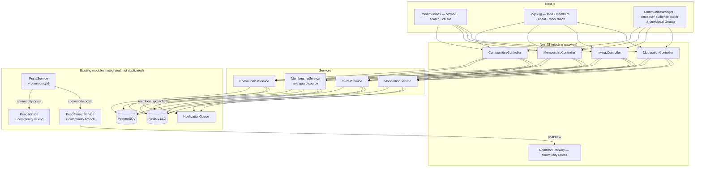
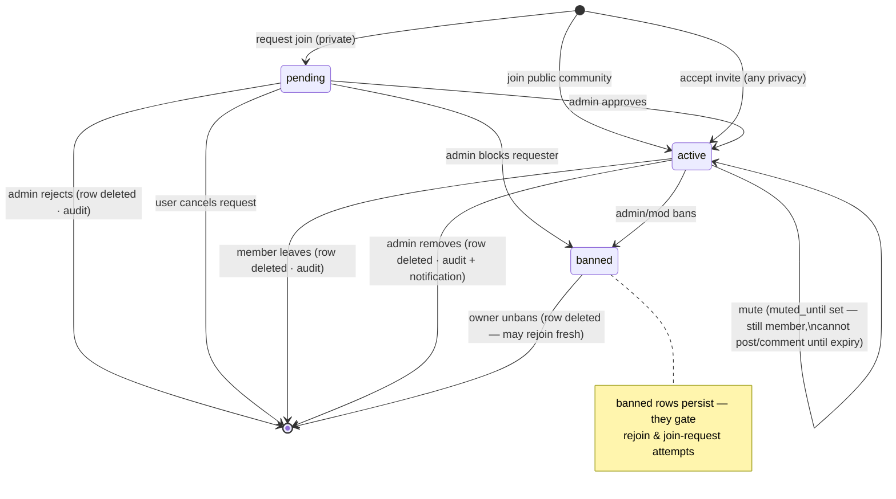
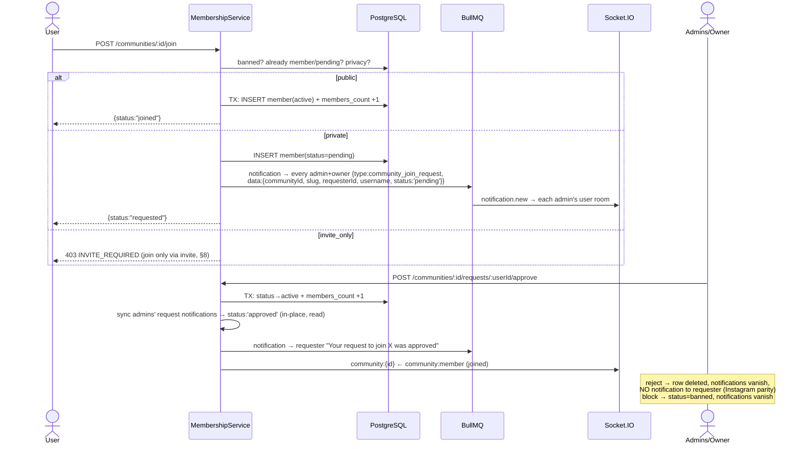
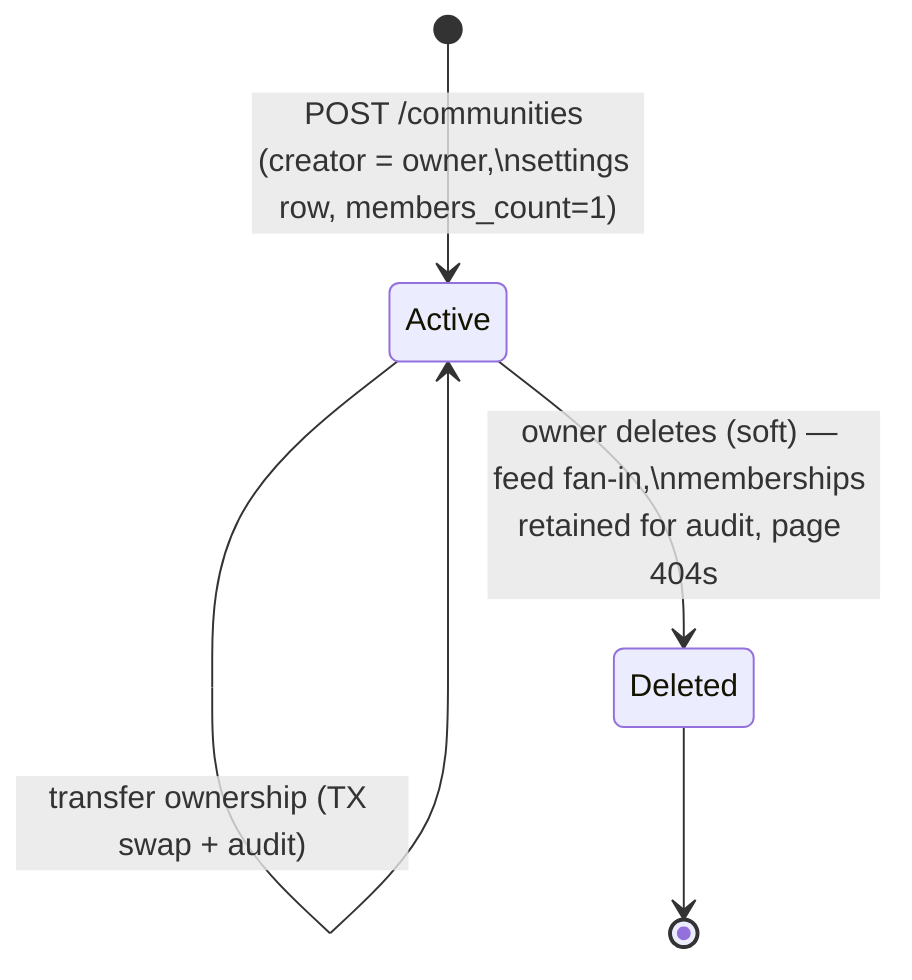
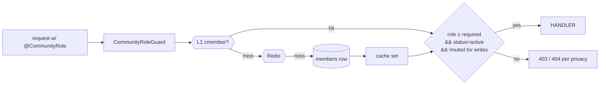
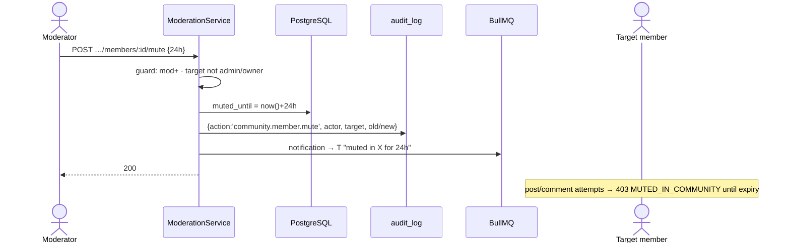

# ZoikoSocial — Communities Module Architecture

**Version:** 1.0 · **Status:** Design — ready for implementation · **Owner:** Platform Engineering
**Companions:** [profile-network-architecture.md](./profile-network-architecture.md) · [feed-posts-architecture.md](./feed-posts-architecture.md) (both implemented & verified)

Communities are interest-based groups — Dog Owners, Rescue Volunteers, Breed Communities, Wildlife Conservation — with membership, roles, moderation, invitations, and a shared post feed. This document specifies the production architecture. Every mechanism reuses a pattern already proven in this codebase; the "Reuse map" below is the module's design thesis.

---

## Table of Contents

1. [Design Thesis & Reuse Map](#1-design-thesis--reuse-map)
2. [System Overview](#2-system-overview)
3. [Community Core & Validation](#3-community-core--validation)
4. [Categories & Tags](#4-categories--tags)
5. [Membership & States](#5-membership--states)
6. [Join Requests](#6-join-requests)
7. [Roles & Permission Matrix](#7-roles--permission-matrix)
8. [Invitations (username + link)](#8-invitations-username--link)
9. [Community Rules](#9-community-rules)
10. [Community Feed & Posts](#10-community-feed--posts)
11. [Discovery & Search](#11-discovery--search)
12. [Moderation Architecture](#12-moderation-architecture)
13. [Database Design](#13-database-design)
14. [Redis Strategy](#14-redis-strategy)
15. [BullMQ Queues](#15-bullmq-queues)
16. [Socket.IO Event Architecture](#16-socketio-event-architecture)
17. [Notifications](#17-notifications)
18. [REST API Specification](#18-rest-api-specification)
19. [Security](#19-security)
20. [Monitoring](#20-monitoring)
21. [Folder Structure](#21-folder-structure)
22. [Diagrams](#22-diagrams)
23. [Implementation Order](#23-implementation-order)

---

## 1. Design Thesis & Reuse Map

Communities introduce exactly **two** genuinely new concepts — *shared-space roles* and *invitations*. Everything else is pattern transfer from shipped modules:

| Communities concern | Reuses (already implemented & verified) |
|---|---|
| Slug rules, uniqueness, availability check | Username system: regex + reserved words + `slug-available` endpoint + trigram index |
| Join / Requested / Joined button states | `FollowButton` state machine (click-to-cancel on Requested) |
| Private-community join requests | Follow-request lifecycle incl. notification syncing (accept updates in place, reject/cancel vanish) |
| Members list w/ role badges + viewer decoration | `FollowListModal` + batch IN-query decoration (no N+1) |
| Community posts | Feed & Posts pipeline — one nullable `community_id` column; composer, carousel, likes, comments, hashtags, mentions all inherit |
| Counters (members_count, posts_count) | Transactional `increment/decrement` + Redis mirror + reconciliation job |
| Privacy gate (private community content) | 404-not-403 post gate, extended with a membership check |
| Avatar/cover upload | Client resize→WebP→blurhash pipeline + owner-path storage RLS |
| Realtime | Existing gateway + rooms (`community:{id}`), Redis pub/sub relay |
| Notifications w/ inline actions | Notification writer + the Accept/Decline inline pattern from follow requests |
| Trending | Redis ZSET + decay job (hashtag trending pattern) |
| Rate limiting, cursor pagination, L1/L2 cache, audit log | All existing infrastructure verbatim |

**Deliberate divergences from the brief (with reasons):**

1. **No `community_roles` table** — role is an enum column on `community_members`. A roles table buys per-community custom roles, which nothing in the product needs; it costs a join on every permission check (the hottest read in the module). The permission matrix lives in code + the seeded-data pattern already used for `professional_permissions`. If custom roles ever ship, the enum column migrates to a FK without breaking the API.
2. **No Socket.IO namespaces** — same decision as Feed & Posts (§16): rooms on the single authenticated gateway provide identical routing with one connection per client. Documented event names match the brief.
3. **Terminal membership states are not rows** — `rejected/removed/left` delete the membership row and write to `audit_log` (existing). Keeping tombstone rows makes every membership check scan dead states forever; the audit log is the history. `banned` and `pending` ARE rows because they gate future behavior.

---

## 2. System Overview



---

## 3. Community Core & Validation

| Field | Rules (Zod, single source shared with client) |
|---|---|
| `name` | 3–60 chars, any language |
| `slug` | 3–40 chars, `a-z0-9-` (hyphenated variant of username rules), no leading/trailing/double hyphen, **reserved-word list** (create, explore, trending, admin, settings, api, …), unique, checked live via `GET /communities/slug-available` |
| `description` | ≤ 1,000 chars |
| `avatarUrl` / `coverUrl` | own-storage-path check (anti-hotlink, same as posts); client resizes avatar 512px / cover 1600×600 WebP |
| `category` | FK into seeded `community_categories` |
| `tags` | ≤ 10, each 2–30 chars lowercase |
| `privacy` | `public` \| `private` \| `invite_only` |
| `rules` | ≤ 15 ordered rules, each title ≤100 + body ≤500 |
| Creation limits | 5 communities owned per user (raise later); `community.create` rate limit 3/day |

**Slug is immutable after creation** (like Reddit) — community URLs are shared externally; a slug-change grace mechanism can be added later with a redirects table, deliberately out of scope.

**Verified badge** — schema slot `is_verified boolean default false` reserved; granting flows through the existing admin verification review surface later. No dedicated flow now.

---

## 4. Categories & Tags

**Configurable categories = a seeded table**, not an enum (the brief requires runtime configurability; enums need migrations to extend):

```
community_categories: id · slug UK · label · icon · position · is_active
Seed: general, dogs, cats, birds, fish, reptiles, wildlife, adoption, rescue,
      veterinarian, pet-care, grooming, training, nutrition, breeding,
      marketplace, verified-news
```

Admin CRUD on categories comes free through Prisma later; the browse page reads `GET /communities/categories` (long-TTL cached).

**Tags** are free-form strings on the community row (`text[]`), trigram-searchable via a computed search document (§11) — normalized like hashtags (lowercase, no `#`). A join-table is unnecessary until tag *pages* exist.

---

## 5. Membership & States

One table drives membership, requests, bans, and mutes:

```
community_members (community_id, user_id) PK
  role   : owner | admin | moderator | member
  status : active | pending | banned
  muted_until  timestamptz NULL   -- moderator mute (auto-expires by comparison)
  accepted_rules_at timestamptz   -- rules consent (§9)
  invited_by uuid NULL            -- provenance for invite analytics
  created_at / updated_at
```

### State diagram



`rejected/removed/left` are **events, not states** — recorded in `audit_log` (existing table: actor, action, entity, old/new data) and the row is deleted. Re-joining after leave/removal starts fresh; after a ban it's blocked until unban.

---

## 6. Join Requests

Identical lifecycle to follow requests (implemented, verified, notification-synced):



The **notification sync** (accept updates in place, reject/cancel deletes, dedupe on re-request) reuses `syncRequestNotification` mechanics from the network module — including the inline **Approve / Decline** buttons on the notifications page, extended to render for `community_join_request`.

---

## 7. Roles & Permission Matrix

| Capability | Owner | Admin | Moderator | Member | Non-member |
|---|:-:|:-:|:-:|:-:|:-:|
| View public community + posts | ✅ | ✅ | ✅ | ✅ | ✅ |
| View private community posts/members | ✅ | ✅ | ✅ | ✅ | ❌ (404) |
| Create posts / comment / like / report | ✅ | ✅ | ✅ | ✅ (unless muted) | ❌ |
| Pin/unpin posts · announcements | ✅ | ✅ | ❌ | ❌ | |
| Delete any post / lock comments | ✅ | ✅ | ✅ | own only | |
| Mute member (timed) | ✅ | ✅ | ✅ | | |
| Remove / ban member | ✅ | ✅ | ❌ | | |
| Approve/reject join requests · manage invites | ✅ | ✅ | ❌ | | |
| Review reports | ✅ | ✅ | ✅ | | |
| Edit info/rules/settings · promote/demote **moderator** | ✅ | ✅ | ❌ | | |
| Promote/demote **admin** · transfer ownership · delete community | ✅ | ❌ | | | |

**Enforcement:** a `@CommunityRole('moderator')` decorator + `CommunityRoleGuard` resolves the caller's membership through the Redis-cached membership lookup (§14) — one L1-cached read, hierarchical comparison (`owner > admin > moderator > member`). Ownership transfer is a single transaction (old owner → admin, new owner → owner) with audit + notification. Exactly one `owner` row per community is enforced in the service layer (partial unique index as backstop: `UNIQUE (community_id) WHERE role='owner'`).

---

## 8. Invitations (username + link)

One table, two invite types:

```
community_invites
  id uuid PK · community_id FK · created_by FK
  type        : user | link
  invitee_id  : uuid NULL      -- type=user: the invited account
  code        : text UK        -- type=link: unguessable 22-char base62
  expires_at  : timestamptz    -- default 7 days, max 30
  max_uses    : int NULL       -- link invites; NULL = unlimited
  uses        : int default 0
  revoked_at  : timestamptz NULL
  created_at
```

### Lifecycle

```mermaid
stateDiagram-v2
    [*] --> issued : admin invites @username / generates link
    issued --> accepted : invitee joins (user-invite consumed;\nlink uses+1, stays issued until max/expiry)
    issued --> declined : user-invite declined (row deleted)
    issued --> revoked : admin revokes
    issued --> expired : expires_at passes (cleanup job)
    accepted --> [*]
    revoked --> [*]
    expired --> [*]
```



- **Invite by username** — `POST /communities/:id/invites {username}` (admin+). Resolves via the cached username→id mapping; blocked-either-direction between inviter and invitee is rejected. Invitee gets a notification with inline **Join / Decline** (the follow-request inline pattern); accepting creates an `active` membership directly — **invites bypass private/invite-only gating** (that's their purpose) — and stamps `invited_by`.
- **Invite link** — `POST /communities/:id/invites {type:'link', expiresInDays?, maxUses?}` → `https://app.zoikosocial.com/c/{slug}?invite={code}`. `GET /invites/:code` validates (exists, not revoked/expired/exhausted, viewer not banned) and returns a community preview; `POST /invites/:code/accept` joins atomically (`uses+1` guarded by `max_uses` in the same UPDATE … WHERE).
- **Revoke** — `DELETE /invites/:id` sets `revoked_at`; link stops validating instantly.
- **Expiry** — the existing scheduled-jobs worker deletes expired/revoked invites older than 30 days (retention for analytics).
- Banned users cannot use invites (checked at accept). QR invites are pure frontend later — the same link encodes as QR.

---

## 9. Community Rules

```
community_rules: id · community_id FK · position · title · body · created_at/updated_at
```

- Managed by admin+ (`PUT /communities/:id/rules` replaces the ordered set — simpler and atomic vs per-rule CRUD for ≤15 rows).
- **Consent flow:** if a community has rules, the join/accept endpoints require `acceptRules: true` in the body; the timestamp is stored on the membership row (`accepted_rules_at`). The frontend join button opens a rules sheet with an "I agree" checkbox when rules exist. Rule *changes* set a `rules_updated_at` on the community; the UI shows "rules updated" — re-consent is deliberately not enforced (Reddit/Facebook parity; forced re-consent walls are hostile and unmoderatable).

---

## 10. Community Feed & Posts

### Posts integration — one column, zero duplication

- Migration adds `posts.community_id uuid NULL REFERENCES communities(id)` + index `(community_id, created_at DESC)` (+ partial pin index).
- `POST /posts` accepts optional `communityId`. PostsService validates: caller is an `active`, un-muted member; community not deleted. Posts into a community get `visibility='community'` (the enum value reserved since migration 000).
- Everything else — carousel media, mentions, hashtags, comments, likes, saves, shares — **inherits with no changes** because it hangs off the post row.

### Pins & announcements

```
community_post_pins: (community_id, post_id) PK · type: pin|announcement · pinned_by · created_at
```
Separate table (per brief) keeps the hot posts row lean; max 3 pins + 1 announcement enforced in service. Announcements additionally fan a `community_announcement` notification to all members (chunked BullMQ job — the fanout worker pattern). `post_approval` (settings flag) is schema-ready: posts created while enabled get `pending_approval=true` on the pin… **deferred** — flag exists in `community_settings`, enforcement ships with the Safety module.

### Privacy gate extension (existing `assertCanViewPost`)

```
post.community_id set?
  ├─ community.privacy = public          → visible to all (author gate still applies)
  └─ private / invite_only               → viewer must be an active member, else 404
```
Batch list variant: one IN-query against the viewer's memberships (same shape as the private-author filter).

### Community timeline & home-feed mixing

```mermaid
flowchart LR
    subgraph CommunityPage["GET /communities/:id/posts"]
        CP[pins first, then cursor (created_at,id) DESC] --> HYD[existing hydration + viewer flags]
    end
    subgraph HomeFeed["GET /feed — mixing"]
        Q["WHERE isDeleted=false AND (<br/>  author ∈ my follows ∪ me<br/>  OR community_id ∈ my active memberships )"] --> HYD
    end
    HYD --> RESP[PostPage]
```

- Home feed's WHERE gains one OR-branch (`community_id IN (SELECT community_id FROM community_members WHERE user_id=:me AND status='active')`) — index-served, still a single query. Members can toggle "Show in home feed" per community later (`community_members.show_in_feed` column reserved, default true).
- **Fanout:** `FeedFanoutService` gains a community branch — community posts bust *members'* `feed:first` keys and emit `post:new` to `feed:{memberId}` rooms, chunked exactly like follower fanout, with the same >10K-members cutoff rule (huge communities merge at read time).
- Community first page cached at `cfeed:first:{communityId}` (shared across members — viewer flags re-attached live, the Feed §4.2 pattern).

Scheduled posts: future-ready via a `publish_at` column slot + the scheduled-jobs worker; **not implemented now**.

---

## 11. Discovery & Search

- **Search document:** generated column `search_doc = name || ' ' || slug || ' ' || array_to_string(tags,' ') || ' ' || left(description,200)` with a **GIN trigram index** — one index covers name/slug/tags/description search (pg_trgm already enabled). Category filtering is a plain indexed equality alongside.
- `GET /communities?q=&category=&sort=trending|popular|newest` — cursor-paginated; `popular` = members_count DESC, `newest` = created_at DESC.
- **Trending** = Redis ZSET `trend:communities` scored by decayed 48h activity (`ZINCRBY` on join +3, post +2, comment +1; 15-min decay pass in the existing scheduled worker — the hashtag-trending pattern verbatim).
- **Recommended** (rank, in order): communities of accounts you follow (member-overlap count — the friend-of-friend GROUP BY pattern), then category affinity from your memberships, then trending fallback for cold start. Ships as `GET /communities/recommended`.
- **Recent searches** — client-side (localStorage), consistent with how the product handles search history today; server-side history is a privacy surface deliberately deferred.
- **Nearby** — future; needs profile geo, out of scope.
- **OpenSearch seam** — the existing `search-index` queue stub gains `community.index/remove` job names now (no-op), so the cutover point already exists.

---

## 12. Moderation Architecture

All moderation actions follow one shape: **permission guard → state change → audit log → notification (where owed) → cache bust → realtime**.

| Action | Effect | Notified |
|---|---|---|
| Remove post | post soft-deleted (`is_deleted`) + counters −1 + pin removed | author: "removed by moderators of X" |
| Lock comments | `posts.comments_disabled = true` (existing flag) | — |
| Mute member (1h/24h/7d) | `muted_until` set; post/comment creation rejects with `MUTED_IN_COMMUNITY` | member |
| Suspend = timed ban | `status=banned` + `muted_until` as auto-lift marker (cleanup job restores… **deferred**: MVP ban is indefinite) | member |
| Ban / unban | `status=banned` / row deleted | member (ban only) |
| Remove member | row deleted + members_count −1 | member |
| Pin / highlight | `community_post_pins` row (`type`) | announcement → all members |
| Report content | `community_reports` row (post/comment/member, reason enum, note) — dedupe per reporter+target | admins+mods (collapsed count) |
| Review report | status `open → actioned/dismissed` + optional inline action | reporter (on action) |

```
community_reports: id · community_id · reporter_id · target_type(post|comment|member)
                   · target_id · reason(spam|harassment|off_topic|misinformation|other)
                   · note ≤500 · status(open|actioned|dismissed) · reviewed_by · reviewed_at
                   UNIQUE (community_id, reporter_id, target_type, target_id)
```

Every action writes `audit_log` (existing table) with `entity_type='community'`, actor, action, and old/new payloads — the moderation history view reads straight from it. Escalation to platform-level Safety review is a later bridge, not duplicated here.

---

## 13. Database Design

### ER Diagram

```mermaid
erDiagram
    profiles ||--o{ communities : "created_by"
    community_categories ||--o{ communities : ""
    communities ||--o{ community_members : ""
    communities ||--o{ community_rules : ""
    communities ||--o{ community_invites : ""
    communities ||--o{ community_reports : ""
    communities ||--|| community_settings : ""
    communities ||--o{ community_post_pins : ""
    communities ||--o{ posts : "community_id NULL"
    profiles ||--o{ community_members : ""
    profiles ||--o{ community_invites : "created_by / invitee"
    posts ||--o| community_post_pins : ""

    communities {
        uuid id PK
        text slug UK "immutable"
        text name
        text description
        text avatar_url
        text cover_url
        uuid category_id FK
        text_arr tags
        community_privacy privacy "public|private|invite_only"
        boolean is_verified "future badge"
        int members_count
        int posts_count
        uuid created_by FK
        timestamptz rules_updated_at
        boolean is_deleted "soft delete"
        timestamptz deleted_at
        timestamptz created_at
        timestamptz updated_at
    }
    community_members {
        uuid community_id PK_FK
        uuid user_id PK_FK
        community_role role "owner|admin|moderator|member"
        member_status status "active|pending|banned"
        timestamptz muted_until
        timestamptz accepted_rules_at
        uuid invited_by
        timestamptz created_at
        timestamptz updated_at
    }
    community_settings {
        uuid community_id PK_FK
        boolean post_approval "deferred enforcement"
        boolean members_can_invite
        jsonb notification_prefs
    }
    community_invites {
        uuid id PK
        uuid community_id FK
        invite_type type "user|link"
        uuid invitee_id
        text code UK
        timestamptz expires_at
        int max_uses
        int uses
        timestamptz revoked_at
        uuid created_by FK
    }
```

### Key indexes & constraints (migration 010)

```sql
-- membership: THE hot path — permission checks, feeds, member lists
CREATE UNIQUE INDEX cm_pk ON community_members (community_id, user_id);
CREATE INDEX cm_user_active ON community_members (user_id) WHERE status = 'active';
CREATE INDEX cm_community_status_role ON community_members (community_id, status, role);
CREATE UNIQUE INDEX cm_one_owner ON community_members (community_id) WHERE role = 'owner';

-- discovery
CREATE INDEX communities_category ON communities (category_id) WHERE is_deleted = false;
CREATE INDEX communities_members_count ON communities (members_count DESC) WHERE is_deleted = false;
CREATE INDEX communities_search_trgm ON communities USING gin (search_doc gin_trgm_ops);

-- community feed
CREATE INDEX posts_community_created ON posts (community_id, created_at DESC)
  WHERE community_id IS NOT NULL AND is_deleted = false;

-- invites
CREATE UNIQUE INDEX invites_code ON community_invites (code) WHERE revoked_at IS NULL;
CREATE INDEX invites_invitee ON community_invites (invitee_id) WHERE invitee_id IS NOT NULL;
```

Soft deletes on `communities` only (posts already have them); membership/invite history lives in `audit_log`. RLS policies mirror the module's permission matrix as defense-in-depth (service role bypasses; direct client access gated).

Prisma models follow the mapped-enum convention (`@@map` snake_case) established in migration 005 — full models generated at implementation time from this DDL.

---

## 14. Redis Strategy

Extends `RedisService` (L1 in-process 15s → L2 Upstash), identical degradation guarantees:

| Key | Type | TTL | Invalidated by |
|---|---|---|---|
| `community:{id}` | JSON community (mapped, incl. settings) | 5m | info/rules/settings edit · counters via member/post events |
| `cslug:{slug}` → id | string | 5m + L1 60s | never changes (immutable slug) |
| `cmember:{communityId}:{userId}` | JSON {role, status, mutedUntil} — **powers every permission check** | 5m + L1 | any membership mutation for that pair |
| `cmemberships:{userId}` | array of active communityIds — feed mixing + widget | 2m | user's own join/leave/removal |
| `cfeed:first:{communityId}` | full first-page payload (viewer flags live) | 60s | community fanout on new post · pin changes |
| `trend:communities` | ZSET decayed activity | rolling | 15-min decay job |
| `cnt:community:{id}` | hash {members, posts} mirror | 6h | exists-only HINCRBY post-commit |

**Philosophy unchanged:** Postgres counters are the truth (transactional increments); Redis mirrors are delete-and-repopulate, never patched; the reconciliation job extends to community counters.

---

## 15. BullMQ Queues

| Queue | New jobs | Consumer |
|---|---|---|
| `notifications` (existing) | community_join_request · request_approved · community_invite · member_removed/banned · role_changed · community_mention · announcement · moderation notices | existing writer |
| `feed` (existing) | community fanout/fan-in branch (members instead of followers, same chunking + celebrity cutoff) | extended worker |
| `community` (new) | `announcement.fanout` (member-wide notification, chunked) · `trending.update` | concurrency 5 |
| `search-index` (existing stub) | `community.index/remove` | no-op → OpenSearch later |
| maintenance (existing) | invite expiry sweep · community counter reconciliation · trending decay · orphaned cover/avatar sweep | existing repeatable schedule |
| `analytics` (existing) | join/leave/report events → growth rollups | existing batcher |

---

## 16. Socket.IO Event Architecture

Rooms on the existing authenticated gateway (no namespaces — §1 divergence note):

| Room | Joined when | Events |
|---|---|---|
| `community:{id}` | viewing a community page (`community.subscribe/unsubscribe`) | `community:updated` (info/settings) · `community:member` {joined/left/removed, memberCount} · `community:role` · `post:new` · `post:pinned` `post:unpinned` · `community:announcement` |
| `feed:{userId}` (existing) | home feed open | `post:new` from communities you're in (fanout) |
| `user:{id}` (existing) | always | `notification.new` for all §17 types — join requests, invites, approvals, role changes, moderation notices |

`community:created/deleted` are not broadcast events (nobody is in the room yet / room dies) — creation surfaces through discovery; deletion emits a final `community:updated {deleted:true}` to the room. Subscription handlers verify membership for private communities before joining the room (gateway checks the cached `cmember` entry — cheap).

---

## 17. Notifications

| Type | Recipient | Inline actions | Dedupe |
|---|---|---|---|
| `community_join_request` | all admins+owner | **Approve / Decline** (follow-request pattern; synced in-place on action by any admin) | per requester+community |
| `community_request_approved` | requester | — | |
| `community_invite` | invitee | **Join / Decline** | one live invite per user+community |
| `community_member_removed` / `banned` | affected member | — | |
| `community_role_changed` | affected member | — | |
| `community_mention` | @mentioned in community post/comment | — (existing mention flow, community context in data) | existing |
| `community_announcement` | all members | — | chunked fanout job |
| `community_report` | admins+mods | — | collapsed "N reports on X" 15-min window |

All carry `data: {communityId, slug, …}` — the notifications page deep-links to `/c/{slug}`. Rejections notify nobody (parity with follow-request rejection).

---

## 18. REST API Specification

Base `/api/v1` · Bearer JWT · `{success,data}` envelope · cursor lists `{data,nextCursor,hasMore}` · Zod validation · role checks via `CommunityRoleGuard` · errors follow the `CODE + message` convention.

### Community CRUD & discovery

| Endpoint | Auth/Role | Success / notable errors |
|---|---|---|
| `POST /communities` — {name*, slug*, description?, categoryId*, privacy?, tags?, avatarUrl?, coverUrl?, rules?} | ✔ (rate 3/day) | 201 · 409 `SLUG_TAKEN` · 409 `COMMUNITY_LIMIT` |
| `GET /communities/slug-available?slug=` | — | 200 {available, reason} |
| `GET /communities/categories` | — | 200 seeded list |
| `GET /communities?q&category&sort&cursor` | optional | 200 page (viewer membership decorated) |
| `GET /communities/trending` · `/recommended` | optional / ✔ | 200 |
| `GET /communities/:slug` (`?withViewer=1` embeds {role,status}) | optional | 200 · 404 (private shows header-only preview: name, avatar, count, rules) |
| `PATCH /communities/:id` — info/settings | admin+ | 200 · 403 `INSUFFICIENT_ROLE` |
| `PUT /communities/:id/rules` — ordered set ≤15 | admin+ | 200 |
| `DELETE /communities/:id` | owner | 200 soft-delete · fan-in |
| `POST /communities/:id/transfer-ownership {userId}` | owner | 200 (target must be active member) |

### Membership & requests

| Endpoint | Role | Notes |
|---|---|---|
| `POST /communities/:id/join {acceptRules?}` | ✔ | → `{status: joined\|requested}` · 403 `INVITE_REQUIRED` · 403 `BANNED` · 400 `RULES_NOT_ACCEPTED` |
| `DELETE /communities/:id/join` | member | leave / cancel request; owner must transfer first → 409 `OWNER_MUST_TRANSFER` |
| `GET /communities/:id/members?role&cursor` | member (private) / any (public) | role-badge + viewer-follow decoration |
| `GET /communities/:id/requests` | admin+ | pending list |
| `POST /communities/:id/requests/:userId/approve` · `/reject` · `/block` | admin+ | notification sync per §6 |
| `POST /communities/:id/members/:userId/remove` · `/ban` · `DELETE …/ban` | admin+ | |
| `POST /communities/:id/members/:userId/mute {duration: 1h\|24h\|7d}` · `DELETE …/mute` | mod+ | |
| `POST /communities/:id/members/:userId/role {role: admin\|moderator\|member}` | admin→mod, owner→admin | 403 on privilege escalation |
| `GET /me/communities` | ✔ | active memberships (widget/picker) |

### Invites

| Endpoint | Role | Notes |
|---|---|---|
| `POST /communities/:id/invites` — {username} \| {type:'link', expiresInDays?≤30, maxUses?} | admin+ (or member if `members_can_invite`) | 201 invite/URL · 404 user · 409 already member/invited |
| `GET /communities/:id/invites` | admin+ | active invites list |
| `DELETE /invites/:id` | admin+ | revoke |
| `GET /invites/:code` | ✔ | community preview · 410 `INVITE_EXPIRED/REVOKED/EXHAUSTED` |
| `POST /invites/:code/accept {acceptRules?}` · decline (user-invites) | ✔ | joins active · 403 `BANNED` |

### Posts, pins, moderation, reports

| Endpoint | Role | Notes |
|---|---|---|
| `POST /posts` + `communityId` (existing endpoint) | active member, not muted | 403 `NOT_A_MEMBER` / `MUTED_IN_COMMUNITY` |
| `GET /communities/:id/posts?cursor` | per privacy | pins+announcement first |
| `POST /communities/:id/posts/:postId/pin {type: pin\|announcement}` · `DELETE` | admin+ | 409 `PIN_LIMIT` (3+1) |
| `DELETE /communities/:id/posts/:postId` | mod+ (any) / author (own) | soft delete + author notice |
| `POST /communities/:id/posts/:postId/lock-comments` · unlock | mod+ | |
| `POST /communities/:id/report {targetType, targetId, reason, note?}` | member | 409 duplicate |
| `GET /communities/:id/reports?status` · `POST …/reports/:id/review {action}` | mod+ | |
| `GET /communities/:id/audit-log?cursor` | admin+ | reads existing audit_log filtered |

---

## 19. Security

- **AuthN**: local JOSE JWT verification (existing) on every route; optional-auth on public reads.
- **AuthZ**: `CommunityRoleGuard` (Redis-cached membership) + service-layer double-checks on destructive ops; privilege-escalation guards (admins can't touch admins; only owner touches admins).
- **Private access**: 404-not-403 everywhere existence should be hidden (posts, members of private communities); header-preview only for private community pages (name/avatar/count — Facebook Groups parity, needed for join requests to make sense).
- **Blocked users**: platform-level blocks suppress invites and mention notifications between the pair; community bans gate join/invite/post.
- **Rate limits** (existing checkMany limiter): create 3/day · join 20/h · invites 30/h · reports 10/h — writes on Redis limiter, reads on the in-process limiter.
- **Spam**: slug/name reserved words; invite codes 22-char base62 (~131 bits); link invites default-capped 7 days; report dedupe.
- **Audit**: every moderation + role + membership mutation → `audit_log`.
- **Media**: own-path upload enforcement (anti-hotlink) as posts; R2 signed URLs when the R2 adapter activates.
- **Soft deletes** on communities/posts; hard membership deletes with audit trail (§5 rationale).

## 20. Monitoring

Extends the existing plan (OTel auto-instrumentation, Sentry, `/health/metrics`): per-queue gauges gain the `community` queue; product metrics from the analytics rollups — communities created/day, join funnel (requests→approvals), DAU per community, report volume; alert on report spikes (>N/hour per community) as an early abuse signal.

---

## 21. Folder Structure

```
apps/api/src/modules/communities/
├── communities.module.ts
├── communities.controller.ts        # CRUD · discovery · categories
├── communities.service.ts
├── communities.schemas.ts           # Zod (shared shapes exported to web)
├── membership/
│   ├── membership.controller.ts     # join/leave/requests/members/roles/mute/ban
│   ├── membership.service.ts        # state machine + cached lookups (guard source)
│   ├── community-role.guard.ts
│   └── community-role.decorator.ts
├── invites/
│   ├── invites.controller.ts
│   └── invites.service.ts
├── moderation/
│   ├── moderation.controller.ts     # pins · post removal · reports · audit view
│   └── moderation.service.ts
└── discovery/
    └── discovery.service.ts         # search doc · trending · recommended

extensions to existing modules:
├── posts/posts.service.ts           # communityId validation + gate branch
├── feed/feed.service.ts             # membership OR-branch
├── queue/feed-fanout.service.ts     # community fanout branch
├── queue/community.worker.ts        # announcements · trending
└── realtime/realtime.gateway.ts     # community.subscribe handlers

apps/web/src/
├── app/communities/page.tsx         # mock → real browse/search/create
├── app/c/[slug]/page.tsx            # community page (feed·members·about·mod)
├── app/invites/[code]/page.tsx      # invite landing
├── components/communities/
│   ├── CommunityCard.tsx · CreateCommunityModal.tsx · JoinButton.tsx
│   ├── MembersModal.tsx · RulesSheet.tsx · InviteModal.tsx
│   ├── ModerationMenu.tsx · ReportModal.tsx
│   └── CommunityPicker.tsx          # composer audience selector
└── components/CommunitiesWidget.tsx # mock → real (GET /me/communities)

Tests co-located *.spec.ts · e2e: apps/api/test/communities.e2e-spec.ts
```

---

## 22. Diagrams

### Community lifecycle



### Permission check flow (hot path)



### Moderation flow



### Redis cache flow · BullMQ flow · deployment — identical shapes to Feed §11/§12/deployment (same infrastructure, new keys/queues per §14–15); not repeated.

---

## 23. Implementation Order

1. **Membership core** — migration 010, communities CRUD, join/leave/requests, roles, members list, `/c/[slug]` page (no posts yet), CommunitiesWidget real
2. **Community posts** — posts.communityId, privacy gate branch, community timeline, home-feed mixing + fanout, composer picker, pins/announcements
3. **Invites + rules** — both invite types, invite landing page, rules management + consent sheet
4. **Discovery + moderation** — browse page real, search doc + trending + recommended, mute/ban/remove, reports, audit view, ShareModal Groups section

Each phase ships independently behind existing CI gates. Deferred with reserved seams: post approval enforcement, scheduled posts, timed suspensions, verified badges, nearby, OpenSearch, community chat (**Messaging teammate** — `conversation_type='community'` is reserved for them; coordinate on room naming before they ship group threads).
