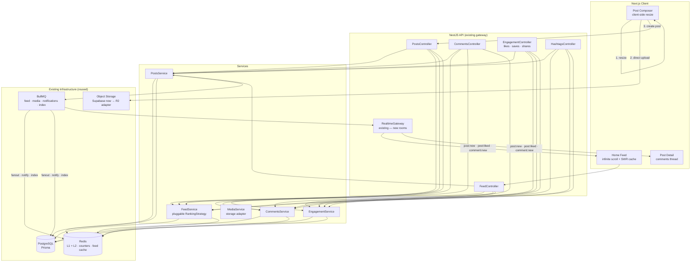
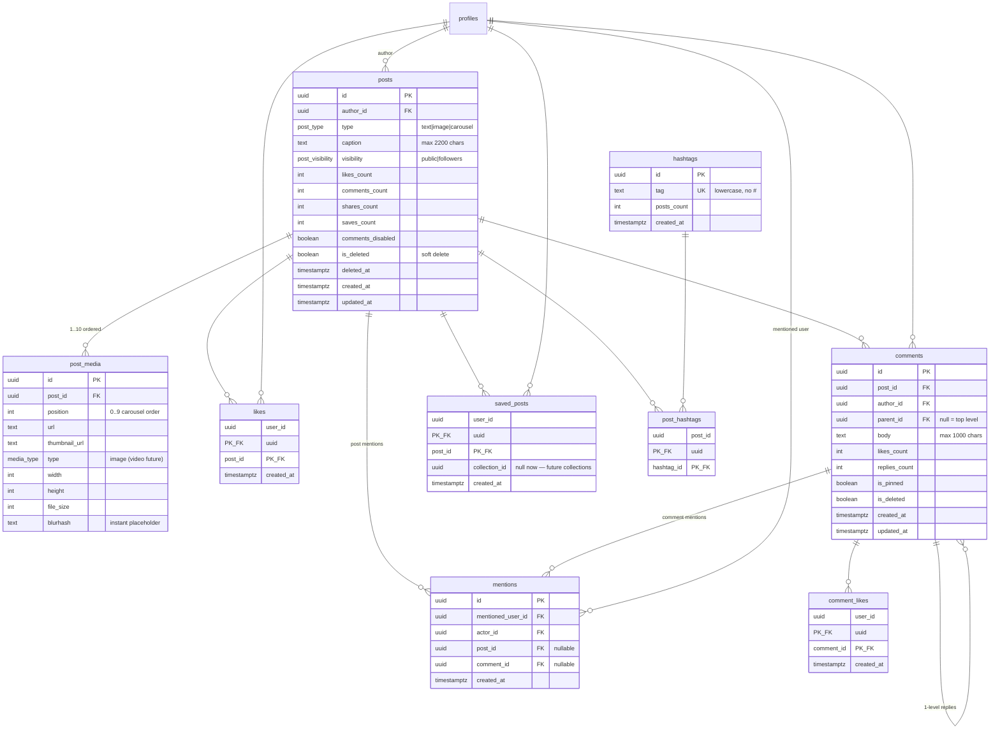
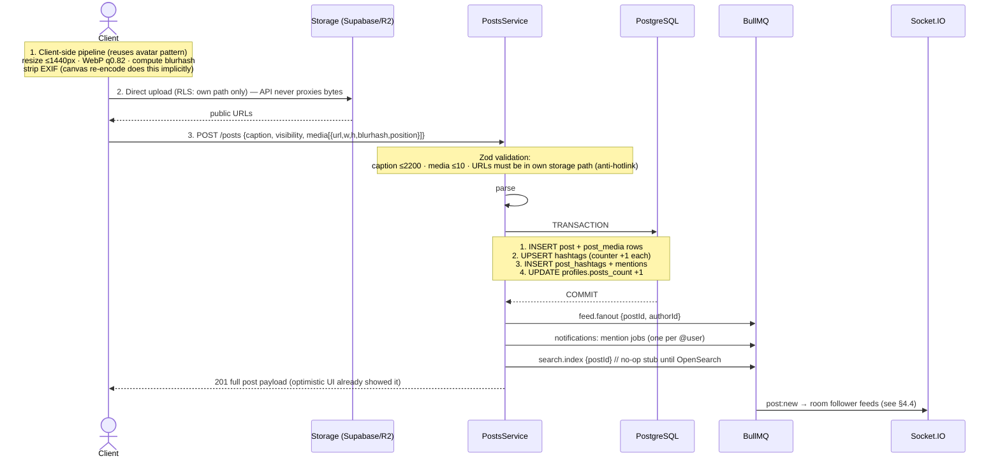
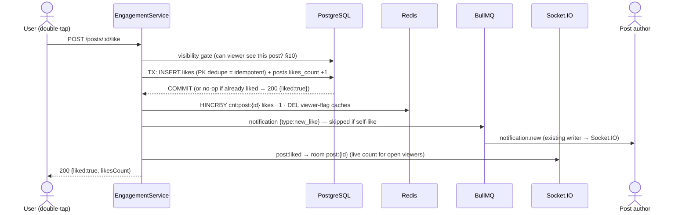
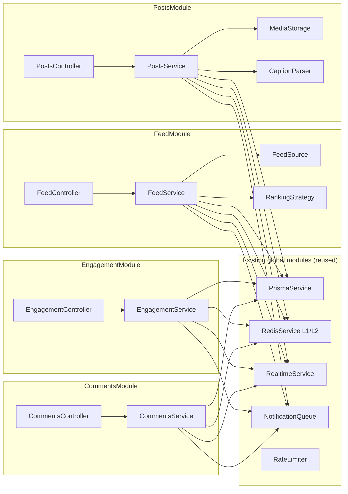
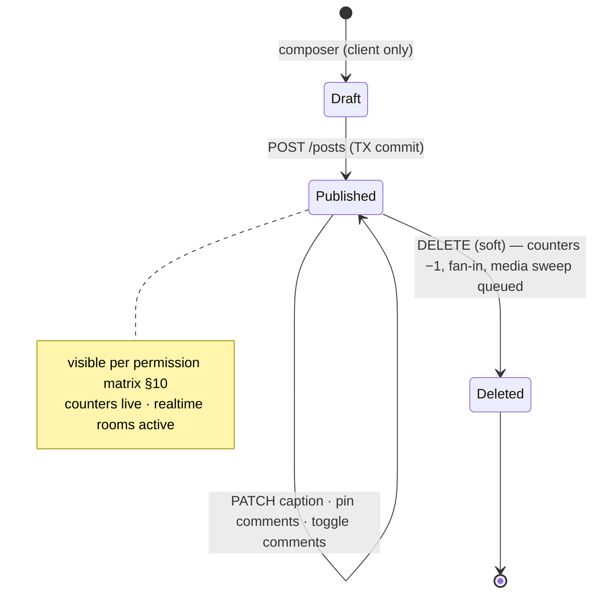
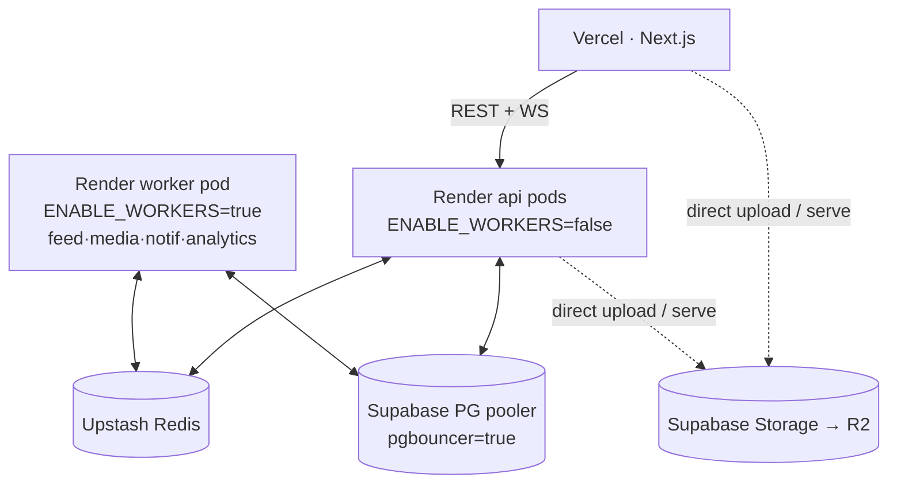

# ZoikoSocial — Feed & Posts Module Architecture

**Version:** 1.0 · **Status:** Design — ready for implementation · **Owner:** Platform Engineering
**Companion:** [profile-network-architecture.md](./profile-network-architecture.md) (implemented & verified)

This document specifies the production architecture for the **Feed & Posts Module**. It reuses every proven pattern from the Profile & Network build — transactional counters, L1/L2 Redis caching, viewer-context batch decoration, cursor pagination, BullMQ delivery, Socket.IO rooms, privacy gates — and introduces nothing that duplicates existing infrastructure.

---

## Table of Contents

1. [System Overview](#1-system-overview)
2. [Database Design](#2-database-design)
3. [Post Creation & Media Pipeline](#3-post-creation--media-pipeline)
4. [Home Feed](#4-home-feed)
5. [Feed Ranking Strategy](#5-feed-ranking-strategy)
6. [Likes](#6-likes)
7. [Comments](#7-comments)
8. [Saves & Shares](#8-saves--shares)
9. [Hashtags & Mentions](#9-hashtags--mentions)
10. [Privacy & Permission Matrix](#10-privacy--permission-matrix)
11. [Redis Strategy](#11-redis-strategy)
12. [BullMQ Queues](#12-bullmq-queues)
13. [Socket.IO Event Architecture](#13-socketio-event-architecture)
14. [Notifications](#14-notifications)
15. [REST API Specification](#15-rest-api-specification)
16. [Monitoring & Observability](#16-monitoring--observability)
17. [Folder Structure](#17-folder-structure)
18. [Diagrams](#18-diagrams)

---

## 1. System Overview



**Core principles (carried over from Profile & Network):**

1. **PostgreSQL is the source of truth; counters are transactional columns** mutated only with atomic `increment/decrement` inside the same transaction as the row change.
2. **Redis is a mirror, never an authority** — L1 in-process (15s) → L2 Upstash (short TTL) → Postgres. Missing keys repopulate; Redis can never invent state.
3. **Side effects run post-commit** through BullMQ; a queue failure can never corrupt the graph.
4. **Viewer context is batch-decorated** — one page of posts gets its `viewerLiked`/`viewerSaved` flags from 2 IN-queries, never N+1.
5. **Every list is cursor-paginated** on `(created_at, id)` using the existing `cursor-pagination.ts` util.

---

## 2. Database Design

### 2.1 ER Diagram



### 2.2 Prisma Models

```prisma
enum MediaType {
  image
  video       // future — schema-ready, not implemented

  @@map("media_type")
}

model Post {
  id               String         @id @default(uuid())
  authorId         String         @map("author_id")
  type             PostType       @default(text)          // existing enum: text|image|… reuse
  caption          String?        @db.VarChar(2200)
  visibility       PostVisibility @default(public)        // existing enum reused
  likesCount       Int            @default(0) @map("likes_count")
  commentsCount    Int            @default(0) @map("comments_count")
  sharesCount      Int            @default(0) @map("shares_count")
  savesCount       Int            @default(0) @map("saves_count")
  commentsDisabled Boolean        @default(false) @map("comments_disabled")
  isDeleted        Boolean        @default(false) @map("is_deleted")
  deletedAt        DateTime?      @map("deleted_at")
  createdAt        DateTime       @default(now()) @map("created_at")
  updatedAt        DateTime       @updatedAt @map("updated_at")

  author   Profile       @relation(fields: [authorId], references: [id], onDelete: Cascade)
  media    PostMedia[]
  likes    Like[]
  comments Comment[]
  saves    SavedPost[]
  hashtags PostHashtag[]
  mentions Mention[]

  // Feed query: author + recency, filtered on soft delete
  @@index([authorId, createdAt(sort: Desc)])
  @@index([createdAt(sort: Desc)])
  @@map("posts")
}

model PostMedia {
  id           String    @id @default(uuid())
  postId       String    @map("post_id")
  position     Int       @default(0)
  url          String
  thumbnailUrl String?   @map("thumbnail_url")
  type         MediaType @default(image)
  width        Int?
  height       Int?
  fileSize     Int?      @map("file_size")
  blurhash     String?   // 20-char placeholder — instant perceived load

  post Post @relation(fields: [postId], references: [id], onDelete: Cascade)

  @@unique([postId, position])
  @@map("post_media")
}

model Like {
  userId    String   @map("user_id")
  postId    String   @map("post_id")
  createdAt DateTime @default(now()) @map("created_at")

  user Profile @relation(fields: [userId], references: [id], onDelete: Cascade)
  post Post    @relation(fields: [postId], references: [id], onDelete: Cascade)

  @@id([userId, postId])          // pair IS the identity — same as follows
  @@index([postId, createdAt(sort: Desc)])   // "liked by" list
  @@map("likes")
}

model Comment {
  id           String    @id @default(uuid())
  postId       String    @map("post_id")
  authorId     String    @map("author_id")
  parentId     String?   @map("parent_id")     // 1 level: parent must be top-level
  body         String    @db.VarChar(1000)
  likesCount   Int       @default(0) @map("likes_count")
  repliesCount Int       @default(0) @map("replies_count")
  isPinned     Boolean   @default(false) @map("is_pinned")
  isDeleted    Boolean   @default(false) @map("is_deleted")
  createdAt    DateTime  @default(now()) @map("created_at")
  updatedAt    DateTime  @updatedAt @map("updated_at")

  post    Post      @relation(fields: [postId], references: [id], onDelete: Cascade)
  author  Profile   @relation(fields: [authorId], references: [id], onDelete: Cascade)
  parent  Comment?  @relation("Replies", fields: [parentId], references: [id], onDelete: Cascade)
  replies Comment[] @relation("Replies")
  likes   CommentLike[]

  @@index([postId, isPinned(sort: Desc), createdAt(sort: Desc)])  // pinned-first thread
  @@index([parentId, createdAt])                                   // reply pages
  @@map("comments")
}

model CommentLike {
  userId    String   @map("user_id")
  commentId String   @map("comment_id")
  createdAt DateTime @default(now()) @map("created_at")

  user    Profile @relation(fields: [userId], references: [id], onDelete: Cascade)
  comment Comment @relation(fields: [commentId], references: [id], onDelete: Cascade)

  @@id([userId, commentId])
  @@map("comment_likes")
}

model SavedPost {
  userId       String   @map("user_id")
  postId       String   @map("post_id")
  collectionId String?  @map("collection_id")  // future: saved_collections table
  createdAt    DateTime @default(now()) @map("created_at")

  user Profile @relation(fields: [userId], references: [id], onDelete: Cascade)
  post Post    @relation(fields: [postId], references: [id], onDelete: Cascade)

  @@id([userId, postId])
  @@index([userId, createdAt(sort: Desc)])   // saved page
  @@map("saved_posts")
}

model Hashtag {
  id         String   @id @default(uuid())
  tag        String   @unique                 // stored lowercase without '#'
  postsCount Int      @default(0) @map("posts_count")
  createdAt  DateTime @default(now()) @map("created_at")

  posts PostHashtag[]

  @@map("hashtags")
}

model PostHashtag {
  postId    String @map("post_id")
  hashtagId String @map("hashtag_id")

  post    Post    @relation(fields: [postId], references: [id], onDelete: Cascade)
  hashtag Hashtag @relation(fields: [hashtagId], references: [id], onDelete: Cascade)

  @@id([postId, hashtagId])
  @@index([hashtagId])            // hashtag page: posts by tag
  @@map("post_hashtags")
}

model Mention {
  id              String   @id @default(uuid())
  mentionedUserId String   @map("mentioned_user_id")
  actorId         String   @map("actor_id")
  postId          String?  @map("post_id")
  commentId       String?  @map("comment_id")
  createdAt       DateTime @default(now()) @map("created_at")

  mentionedUser Profile  @relation("MentionedUser", fields: [mentionedUserId], references: [id], onDelete: Cascade)
  actor         Profile  @relation("MentionActor", fields: [actorId], references: [id], onDelete: Cascade)
  post          Post?    @relation(fields: [postId], references: [id], onDelete: Cascade)
  comment       Comment? @relation(fields: [commentId], references: [id], onDelete: Cascade)

  @@index([mentionedUserId, createdAt(sort: Desc)])
  @@map("mentions")
}

// Future — schema reserved, not implemented:
// model PostView { userId, postId, viewedAt } — feeds the recommendation engine
```

**Key physical decisions** (mirroring the follows table rationale):

| Decision | Why |
|---|---|
| `likes` / `saved_posts` / `comment_likes` composite PKs, no surrogate id | The pair is the identity; halves index size on the hottest tables |
| `posts(author_id, created_at DESC)` index | The feed's core query and profile grids are both index-range scans |
| `comments(post_id, is_pinned DESC, created_at DESC)` | One index serves the pinned-first thread ordering |
| Hashtags normalized (`hashtags` + join table), not a text[] column | Trending = `ORDER BY posts_count`; hashtag pages = one indexed join; counter maintained transactionally |
| Soft delete on `posts`/`comments` only | Engagement rows (likes/saves) hard-delete with cascade; history lives in `audit_log` (existing) |
| `blurhash` on media | 20-char string rendered as instant placeholder — biggest perceived-speed win per byte |
| `profiles.posts_count` (existing column) | Incremented/decremented in the create/delete transaction — same pattern as followers_count |

**Migration:** `009_feed_posts.sql` — extends the existing minimal `posts` table (adds `saves_count`, `comments_disabled`, `deleted_at`), creates the new tables, RLS policies mirroring the follows/posts precedent, and the enum `media_type`.

---

## 3. Post Creation & Media Pipeline

### 3.1 Upload Architecture

Storage today is **Supabase Storage** (`post-media` bucket already exists with owner-path RLS: `{userId}/…`, 50MB, jpeg/png/webp/mp4). Cloudflare R2 is the stated target. The design isolates this behind a **storage adapter** so R2 is a config change, not a rewrite:

```ts
interface MediaStorage {
  /** Issue a short-lived signed upload URL for a client-direct upload. */
  createUploadUrl(userId: string, filename: string, mime: string): Promise<{ uploadUrl: string; publicUrl: string; path: string }>
  delete(paths: string[]): Promise<void>
}
// SupabaseMediaStorage (now) · R2MediaStorage (when R2 creds land — S3 presigned PUT)
```

### 3.2 Creation Flow



**Validation limits** (Zod, single source of truth shared with the client):

| Rule | Limit |
|---|---|
| Caption | ≤ 2,200 chars (Instagram parity) |
| Media per post | 1–10 (carousel), 0 for text posts |
| Client-resized dimensions | max edge 1440px, thumbnail 320px |
| Accepted formats | jpeg, png, webp, gif (video: schema-ready, rejected at API until Phase 2) |
| File size after resize | ≤ 2MB enforced client-side; bucket enforces 50MB hard cap |
| Hashtags per post | ≤ 30 · Mentions per post | ≤ 20 |
| Rate limit | `post.create` 10/hour, `comment.create` 30/min (existing checkMany limiter) |

**Media hardening:** URLs submitted to `POST /posts` must match `^{storagePublicBase}/{authorId}/` — a user can only attach media from their own storage folder (prevents hot-linking others' uploads). Virus scanning is a future `media` queue consumer slot (ClamAV container) — the pipeline shape already supports inserting it between upload and publish by marking media `pending → clean`.

---

## 4. Home Feed

### 4.1 Strategy: fan-out-on-read now, fan-out-on-write ready

**Phase 1 (implement now): pull model.** The feed query is a single indexed scan:

```sql
SELECT p.* FROM posts p
WHERE p.author_id IN (
        SELECT following_id FROM follows
        WHERE follower_id = :me AND status = 'active'
        UNION SELECT :me)                      -- own posts included
  AND p.is_deleted = false
  AND (p.created_at, p.id) < (:cursorTime, :cursorId)   -- keyset pagination
ORDER BY p.created_at DESC, p.id DESC
LIMIT :limit + 1;                              -- +1 → hasMore
```

Served by `posts(author_id, created_at DESC)` + `follows(follower_id, status)` (both exist). Correct and fast to ~1–2K followings per user; **the right choice at current scale** because it has zero write amplification and zero consistency debt.

**Phase 2 (designed, not built): push model.** When p95 feed latency degrades, the `feed.fanout` job (already enqueued on every post — currently used for realtime only) additionally writes the post id into each follower's Redis timeline:

```
ZADD timeline:{followerId} <createdAtMs> <postId>     (capped: ZREMRANGEBYRANK 0 -801)
```

Feed read becomes `ZREVRANGEBYSCORE` + one `WHERE id IN (…)` hydration query. **Celebrity rule:** authors with > 10K followers are NOT fanned out; their posts merge in at read time (hybrid pull) — the standard Instagram/Twitter solution to write amplification. The seam between phases is one interface:

```ts
interface FeedSource {
  page(userId: string, cursor: string | null, limit: number): Promise<{ postIds: string[]; nextCursor: string | null }>
}
// PullFeedSource (Phase 1) · HybridTimelineFeedSource (Phase 2) — swap via env flag
```

### 4.2 Serving pipeline

```
GET /feed?cursor=…
  1. FeedSource.page()          → ordered post ids
  2. Post hydration             → L1/L2 post:{id} cache, batch-miss → single IN query
  3. Viewer decoration          → 2 IN-queries: my likes, my saves (batch, no N+1)
  4. Author hydration           → existing profile:{id} L1/L2 cache
  5. Response                   → { data, nextCursor, hasMore }
```

**First page cached:** `feed:first:{userId}` (60s TTL, L2 only) — the most-hit query in the product costs Redis-only on repeat opens. Invalidated when anyone the user follows posts (fanout job deletes followers' first-page keys — cheap DEL fan-out even in Phase 1).

### 4.3 Frontend behavior

- **Infinite scroll** — IntersectionObserver sentinel, fetches next cursor at 80% scroll; the existing SWR client cache makes back-navigation instant.
- **New-post banner, not injection** — on `post:new` socket event, show "New posts ↑" pill (Instagram/Twitter pattern); tapping prepends without scroll-jank. Pull-to-refresh does the same via `GET /feed` with no cursor.
- **Prefetch** — page N+1 fetched when page N renders; images beyond the fold get `loading="lazy"`; blurhash placeholders paint instantly.
- **Optimistic create** — composer inserts the post locally on submit; reconciles with the 201 payload.

---

## 5. Feed Ranking Strategy

**Now:** strict reverse-chronological `(created_at, id) DESC`. Honest, cheap, and correct for a young network where users follow few accounts.

**Design for later — pluggable scoring at the FeedSource seam:**

```ts
interface RankingStrategy {
  /** Re-order (and optionally augment) a candidate page. Pure function of features. */
  rank(viewerId: string, candidates: ScoredPost[]): Promise<ScoredPost[]>
}
// ChronologicalRanking (now) → WeightedRanking (later) → ML re-ranker (future)
```

The future `WeightedRanking` composes per-post features already being captured or one job away:

| Signal | Source | Availability |
|---|---|---|
| Recency decay `e^(-Δt/τ)` | post.created_at | now |
| Relationship score | interaction counts viewer↔author (likes/comments given) — aggregated nightly by the existing scheduled-jobs worker into `affinity:{viewer}` Redis hash | one job |
| Engagement velocity | likes_count/comments_count per hour since publish | now (counters exist) |
| Content type boosts | professional/verified-news author flags (profiles module) | now |
| Interests / community relevance | post_views + hashtag follows | future tables (schema slots reserved) |

Candidate sources also plug in at the same seam: `FollowedSource` (now) + `SuggestedSource`/`TrendingSource`/`SponsoredSource` (future) feed a mixer with slot rules (e.g. 1 suggested per 6 followed). **Nothing about chronological Phase 1 has to change to add these — they are additional FeedSources + a RankingStrategy swap.**

---

## 6. Likes

Same architecture as Follow — proven, transactional, realtime:



- **Unlike** — mirror transaction with decrement; **no notification** (parity with unfollow rule).
- **Idempotency** — composite PK makes duplicate like/unlike a no-op, never an error (double-tap safe).
- **Liked-users list** — `GET /posts/:id/likes`, cursor-paginated, decorated with the existing `followsViewer/viewerFollows` batch (Follow buttons in the list, Instagram parity).
- **Like notifications are throttled** — the notification job for `new_like` on the same post collapses within a 5-minute window into "X and N others liked your post" (BullMQ jobId = `like:{postId}` with debounce), preventing notification storms on popular posts.
- **Counter sync** — the existing counter-reconciliation scheduled job extends to recompute `likes_count/comments_count/saves_count/posts_count` from source tables.

**Mutual likes** ("liked by people you follow"): read-time batch — for a feed page, one query `SELECT post_id, user_id FROM likes WHERE post_id IN (…) AND user_id IN (SELECT following_id …) LIMIT 3 per post` via lateral join; returned as `likedByFollowed: [{username, avatarUrl}]`.

---

## 7. Comments

- **Thread shape:** top-level comments + **exactly one reply level** (`parent_id` must reference a top-level comment; replying to a reply re-parents to its parent — Instagram behavior). Enforced in service, guaranteed by check in the transaction.
- **Ordering:** pinned first (author can pin ≤3), then newest; replies chronological ascending. One composite index serves it (§2.2).
- **Create** — TX: insert + `posts.comments_count +1` (+ `parent.replies_count +1` for replies) → post-commit: mention notifications, `comment:new` to room `post:{id}`, author notification (skip self).
- **Edit** — author only, 15-minute window OR no engagement yet; sets `updated_at` → renders "(edited)".
- **Delete** — soft delete; author of the comment OR author of the post may delete (Instagram parity). Replies of a deleted top-level comment stay visible under "(deleted)" placeholder. Counter decremented in the same TX.
- **Comment likes** — identical mini-pattern to post likes (composite PK, counter column, no notification on unlike).
- **Pagination** — cursor on `(is_pinned, created_at, id)`; replies lazy-load per parent ("View 12 replies").
- `comments_disabled` on the post short-circuits creation with `403 COMMENTS_DISABLED`.

---

## 8. Saves & Shares

**Saves** — private bookmarks, invisible to everyone including the post author (Instagram semantics: `saves_count` is visible to the author only, in insights; MVP: author sees count on own posts).
- `POST/DELETE /posts/:id/save` — composite-PK idempotent, `saves_count ±1` transactional.
- `GET /me/saved` — cursor-paginated grid; strictly `userId = me`. No notification (optional flag reserved).
- `collection_id` column reserved; `saved_collections` table is a later additive migration.

**Shares**
- **Copy link** — `POST /posts/:id/share {type:'link'}` records the event (`shares_count +1`, analytics queue) and returns the canonical URL `https://app.zoikosocial.com/p/{postId}`.
- **Internal share (to DM)** — records `{type:'internal'}`; actual message delivery belongs to the Messaging module and plugs in when it ships.
- Share events flow to the `analytics` queue (fire-and-forget) — the future insights dashboard reads from there. External share targets (WhatsApp/X intents) are pure frontend, counted with `{type:'external'}`.

---

## 9. Hashtags & Mentions

**Hashtags**
- Parsed server-side from the caption: `/#([\p{L}\p{N}_]{1,50})/gu`, lowercased, deduped, ≤30.
- Upserted in the create transaction with `posts_count +1`; decremented on post delete.
- **Hashtag page** — `GET /hashtags/:tag/posts`: indexed join through `post_hashtags`, newest-first cursor, privacy-filtered (private authors' posts visible only to their accepted followers — same batch gate as feed hydration).
- **Trending** — Redis sorted set `trend:hashtags` scored by decayed 48h usage, recomputed every 15 min by the existing scheduled-jobs worker (`ZINCRBY` on post create + periodic decay pass). `GET /hashtags/trending` reads the top 10 straight from Redis.
- **Search** — prefix + trigram against `hashtags.tag` (pg_trgm already enabled); "follow hashtag" is a reserved future table.

**Mentions**
- Parsed `/@([a-z0-9._]{3,30})/g`, resolved via the existing cached username→id mapping (invalid usernames silently dropped).
- Rows written in the create transaction; notification job per mentioned user (`type: mention`, deep-links to the post) — skipped for self-mentions and for mentioned users who blocked the author.
- Frontend: composer autocomplete reuses `GET /network/search` (existing, trigram-indexed, viewer-decorated); rendered captions linkify `@username` → `/profile/{username}` and `#tag` → `/explore/tags/{tag}`.

---

## 10. Privacy & Permission Matrix

One gate, applied at every entry point (single-post view, feed hydration, hashtag pages, likes/comments on the post):

```ts
async assertCanViewPost(post, viewerId): void
// blocked either direction            → 404 POST_NOT_FOUND   (existence hidden)
// author deleted/suspended            → 404
// post.is_deleted                     → 404
// author public                       → allow
// author private + viewer follows    → allow
// author private otherwise            → 404 (NOT 403 — don't confirm the post exists)
```

| Viewer ↓ / Author → | Public account | Private account | Blocked me | I blocked them |
|---|---|---|---|---|
| Anonymous (no auth) | ✅ view | ❌ 404 | ❌ 404 | — |
| Authenticated, not following | ✅ view · like · comment · save · share | ❌ 404 | ❌ 404 | ❌ 404 |
| Accepted follower | ✅ all | ✅ all | ❌ 404 | ❌ 404 |
| Author | ✅ all + edit/delete/pin | ✅ same | — | — |

Batch form for lists (feed/hashtag pages): posts by private authors are pre-filtered with one IN-query against the viewer's follow set — the same decoration query pattern as `followsViewer`. Post URLs are unguessable UUIDs but **privacy never relies on that** — the gate runs on every read.

---

## 11. Redis Strategy

All through the existing `RedisService` (L1 in-process 15s → L2 Upstash), same degraded-mode guarantees:

| Key | Type | TTL | Written | Invalidated |
|---|---|---|---|---|
| `post:{id}` | JSON post + media + author snapshot | 5m | read-through | post edit/delete · counter drift >N |
| `cnt:post:{id}` | hash {likes, comments, saves, shares} | 6h | post-commit HINCRBY (exists-only) | TTL |
| `feed:first:{userId}` | JSON first page | 60s | read-through | fanout job DELs followers' keys on new post |
| `viewer:{userId}:likes:{postIdPage}` | — not cached; 2 IN-queries per page are cheap and always-correct | | | |
| `trend:hashtags` | ZSET decayed 48h score | — | ZINCRBY on create · 15-min decay job | rolling |
| `timeline:{userId}` | ZSET postIds (Phase 2) | capped 800 | fanout worker | post delete → ZREM fan-in |

**Invalidation philosophy (unchanged):** counters mutate transactionally in Postgres and are *mirrored* with exists-only HINCRBY; caches are deleted, never patched; anything missing repopulates from the source of truth. The existing reconciliation job is the drift backstop.

---

## 12. BullMQ Queues

Extends the existing queue module (same connection factory, `ENABLE_WORKERS` flag, inline fallback):

| Queue | Jobs | Consumer behavior |
|---|---|---|
| `notifications` (existing) | new_like (debounced) · new_comment · comment_reply · mention · post_shared | existing NotificationWriter → DB + Socket.IO |
| `feed` (new) | `fanout {postId}` — Phase 1: DEL followers' `feed:first:*` + emit `post:new`; Phase 2: + timeline ZADDs with celebrity cutoff · `fanin {postId}` on delete | concurrency 5, chunked follower scan (1K/batch) |
| `media` (new) | `postprocess {mediaId}` — thumbnail verify, (future: video transcode, virus scan) | concurrency 3 |
| `search-index` (new) | `index/remove {postId}` — **no-op stub now**; OpenSearch writer later | concurrency 5 |
| `analytics` (new) | share/view events → append-only rollups | concurrency 1, batched |
| maintenance (existing) | + counter reconciliation for posts/comments/hashtags · orphaned-media sweep (storage objects with no post_media row after 24h) · trending decay | existing repeatable schedule |

---

## 13. Socket.IO Event Architecture

**Deliberate divergence from the brief:** no new namespaces. Separate `/feed` `/posts` namespaces would mean multiple authenticated connections per client for zero isolation benefit. The existing single authed gateway + **rooms** gives the same routing with one connection — consistent with the Profile & Network build:

| Room | Joined when | Events received |
|---|---|---|
| `user:{id}` (existing, automatic) | connect | `notification.new` (all types) |
| `feed:{userId}` | client on home feed (`feed.subscribe`) | `post:new` {postId, author} → "New posts" pill |
| `post:{postId}` | client viewing a post/detail (`post.subscribe` / `post.unsubscribe`) | `post:liked` `post:unliked` {likesCount} · `comment:new` `comment:updated` `comment:deleted` · `post:updated` `post:deleted` |

All emissions go through the existing `RealtimeService.publish()` → Redis pub/sub relay (multi-pod safe). Event payloads carry ids + deltas, never full re-renders; clients patch their SWR caches. `mention:new` arrives as a `notification.new` on the user room (it *is* a notification — no parallel channel).

---

## 14. Notifications

Reuses the notification writer + inline Accept-pattern list UI end-to-end:

| Type | Trigger | Body | Dedupe/throttle |
|---|---|---|---|
| `new_like` | like on your post | "X liked your post" / "X and N others…" | 5-min collapse per post |
| `new_comment` | comment on your post | "X commented: '…'" (40-char preview) | none |
| `comment_reply` | reply to your comment | "X replied to your comment" | none |
| `mention` | @you in post/comment | "X mentioned you" | 1 per actor+post |
| `post_shared` | internal share of your post | "X shared your post" | 5-min collapse |
| `post_saved` | reserved (off by default) | — | — |

All carry `data: {postId, commentId?, username}` — the notifications page already navigates by `data.username`; it gains `postId` deep-linking (`/p/{postId}`). Self-actions never notify. Blocked-either-direction suppresses at enqueue time.

---

## 15. REST API Specification

Base `/api/v1` · Bearer JWT (local JWKS verify) · envelope `{success, data} | {success:false, error:{code,message}}` · cursor lists return `{data, nextCursor, hasMore}` · limits capped at 50 · Zod on every body.

### Posts

| Endpoint | Auth | Success | Errors |
|---|---|---|---|
| `POST /posts` — `{caption?, visibility?, media?: [{url*, width, height, blurhash, position}], commentsDisabled?}` (caption or media required) | ✔ | 201 full post | 400 `VALIDATION_ERROR` · 400 `MEDIA_NOT_OWNED` · 429 |
| `GET /posts/:id` | optional | 200 post + viewer flags {viewerLiked, viewerSaved} | 404 `POST_NOT_FOUND` (covers private/blocked) |
| `PATCH /posts/:id` — `{caption?, commentsDisabled?}` (media immutable — Instagram parity) | ✔ author | 200 | 403 `NOT_AUTHOR` · 404 |
| `DELETE /posts/:id` | ✔ author | 200 (soft; counters −1; fan-in) | 403 · 404 |
| `GET /media/upload-url` — `?filename&mime` | ✔ | 200 {uploadUrl, publicUrl} | 400 `UNSUPPORTED_FORMAT` |

### Feed & profile grids

| Endpoint | Notes |
|---|---|
| `GET /feed?cursor&limit` | home feed (§4); first page L2-cached |
| `GET /profiles/:id/posts?cursor` | profile grid; privacy-gated; media-only variant `?mediaOnly=1` |
| `GET /me/saved?cursor` | private saved grid |
| `GET /me/liked?cursor` | optional own-likes list |

### Engagement

| Endpoint | Success | Errors |
|---|---|---|
| `POST /posts/:id/like` · `DELETE /posts/:id/like` | 200 {liked, likesCount} — idempotent | 404 · 403 `COMMENTS_DISABLED` n/a |
| `GET /posts/:id/likes?cursor` | follower-decorated user list | 404 |
| `POST /posts/:id/save` · `DELETE /posts/:id/save` | 200 {saved} | 404 |
| `POST /posts/:id/share` — `{type: link\|internal\|external}` | 200 {url, sharesCount} | 404 |

### Comments

| Endpoint | Success | Errors |
|---|---|---|
| `POST /posts/:id/comments` — `{body*, parentId?}` | 201 comment | 403 `COMMENTS_DISABLED` · 404 · 400 |
| `GET /posts/:id/comments?cursor` · `GET /comments/:id/replies?cursor` | 200 pinned-first thread | 404 |
| `PATCH /comments/:id` — `{body}` | 200 | 403 `EDIT_WINDOW_CLOSED` / `NOT_AUTHOR` |
| `DELETE /comments/:id` | 200 (author or post-author) | 403 · 404 |
| `POST /comments/:id/like` · `DELETE …/like` | 200 {liked, likesCount} | 404 |
| `POST /posts/:id/comments/:cid/pin` · `DELETE …/pin` | 200 (post author, ≤3 pinned) | 403 `PIN_LIMIT` |

### Hashtags

| Endpoint | Notes |
|---|---|
| `GET /hashtags/trending` | top 10 from Redis ZSET |
| `GET /hashtags/search?q` | prefix+trigram |
| `GET /hashtags/:tag/posts?cursor` | privacy-filtered page |

---

## 16. Monitoring & Observability

| Concern | Tool | What |
|---|---|---|
| Errors | **Sentry** (`@sentry/nestjs` + Next.js SDK) | unhandled exceptions, release tagging; DSN env slot already reserved in config schema |
| Tracing | **OpenTelemetry** auto-instrumentations (http, prisma, ioredis, socket.io) → OTLP | p50/p95/p99 per route; trace joins API→queue via job metadata |
| DB | `pg_stat_statements` (Supabase dashboard) + Prisma slow-query threshold log (>500ms warn) | top queries, index misses |
| Cache | counters in RedisService: L1 hits / L2 hits / misses exposed on `/api/v1/health/metrics` | cache hit ratio per namespace |
| Queues | BullMQ events → gauge (waiting/active/failed per queue) on the same metrics endpoint; alert on failed > 10/min | queue lag |
| Health | existing Terminus `/health` + added indicators: redis ping, queue connectivity, storage HEAD | Render health check target |

---

## 17. Folder Structure

```
apps/api/src/modules/
├── feed/
│   ├── feed.module.ts
│   ├── feed.controller.ts          # GET /feed
│   ├── feed.service.ts             # orchestration: source → hydrate → decorate
│   ├── sources/
│   │   ├── feed-source.interface.ts
│   │   ├── pull-feed.source.ts     # Phase 1
│   │   └── hybrid-timeline.source.ts  # Phase 2 (flagged)
│   └── ranking/
│       ├── ranking.strategy.ts
│       └── chronological.ranking.ts
├── posts/
│   ├── posts.module.ts
│   ├── posts.controller.ts         # CRUD + upload-url
│   ├── posts.service.ts            # create TX, privacy gate, hydration cache
│   ├── media/
│   │   ├── media-storage.interface.ts
│   │   ├── supabase.storage.ts
│   │   └── r2.storage.ts           # activated by env
│   ├── caption-parser.ts           # hashtags + mentions extraction
│   └── posts.schemas.ts            # Zod (shared shapes exported to web)
├── engagement/
│   ├── engagement.module.ts
│   ├── engagement.controller.ts    # likes · saves · shares
│   └── engagement.service.ts
├── comments/
│   ├── comments.module.ts
│   ├── comments.controller.ts
│   └── comments.service.ts
├── hashtags/
│   ├── hashtags.module.ts
│   ├── hashtags.controller.ts
│   └── hashtags.service.ts
└── queue/                          # existing — extended
    ├── feed.worker.ts              # fanout / fanin
    ├── media.worker.ts
    ├── search-index.worker.ts      # stub
    └── analytics.worker.ts

apps/web/src/
├── app/(feed)/page.tsx             # home feed (replaces mock PostCard)
├── app/p/[postId]/page.tsx         # post detail + thread
├── app/explore/tags/[tag]/page.tsx
├── components/feed/
│   ├── PostComposer.tsx            # resize + blurhash + direct upload
│   ├── PostCard.tsx                # rebuilt: real data, carousel, double-tap
│   ├── LikeButton.tsx / SaveButton.tsx / ShareMenu.tsx
│   ├── CommentThread.tsx / CommentInput.tsx (mention autocomplete)
│   └── NewPostsPill.tsx
└── lib/api.ts                      # + postsApi, feedApi, commentsApi (cachedGet/mutate)

Tests: *.spec.ts co-located; e2e flows in apps/api/test/feed.e2e-spec.ts
```

---

## 18. Diagrams

### Component



### Post lifecycle (state)



### Like flow / cache flow (combined)

```mermaid
flowchart LR
    A[POST /posts/:id/like] --> B{{privacy gate}}
    B --> C[(TX: likes row + likes_count+1)]
    C --> D[HINCRBY cnt:post · DEL post:{id}]
    C --> E[BullMQ new_like debounced]
    C --> F[WS post:liked → room post:id]
    E --> G[(notification row)] --> H[WS notification.new → user room]
```

### Deployment (unchanged topology, new workers)



---

## Implementation order (suggested)

1. Migration 009 + Prisma models + posts CRUD + media upload (composer works end-to-end)
2. Feed (pull source) + profile grids + privacy gate — home feed is real
3. Likes + saves + realtime rooms — engagement loop closes
4. Comments + replies + pins — conversation layer
5. Hashtags + mentions + trending job — discovery layer
6. Shares + analytics queue + monitoring wiring

Each step ships independently behind the existing CI gates; nothing blocks on R2, OpenSearch, or the recommendation engine — those land later at the documented seams.
