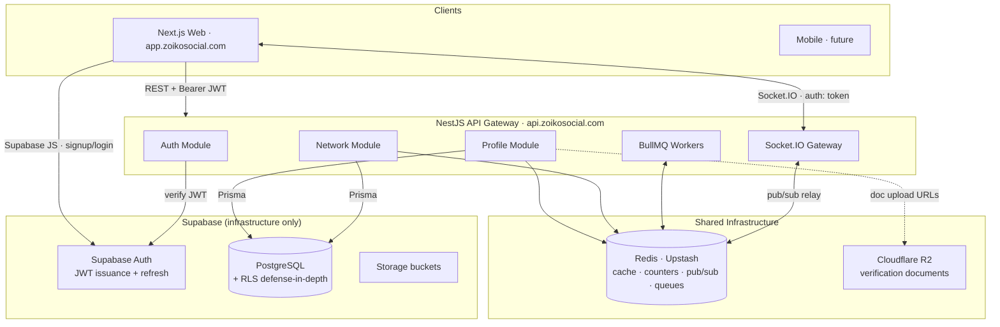
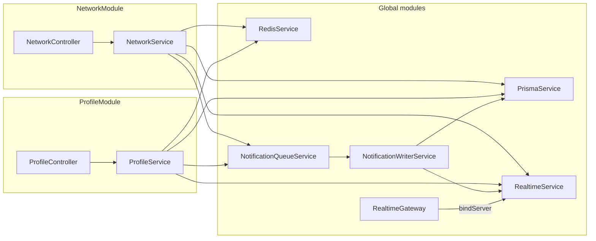
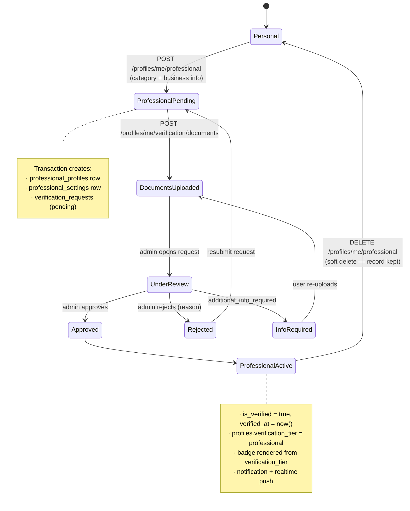
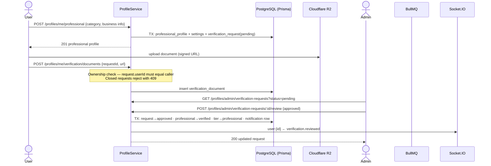
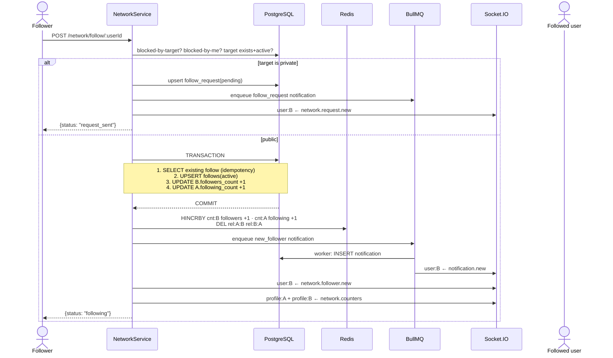
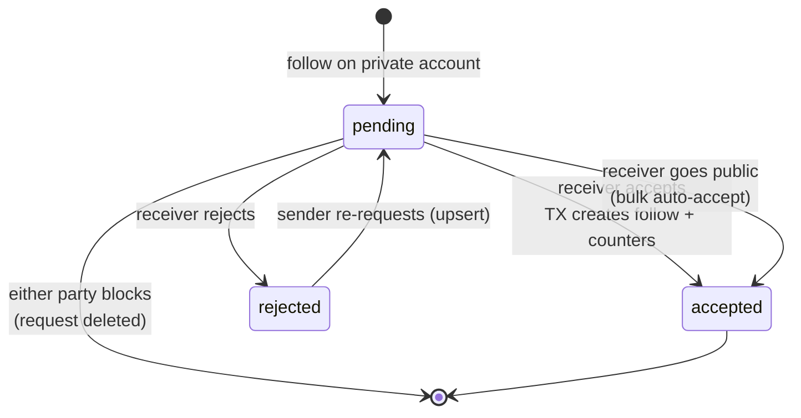
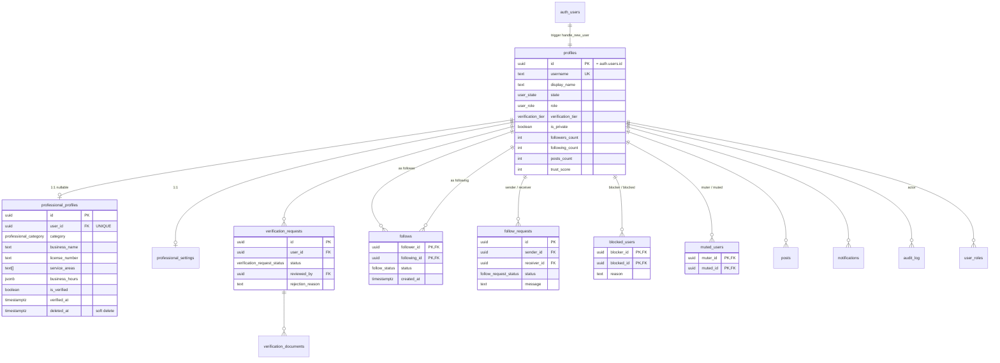
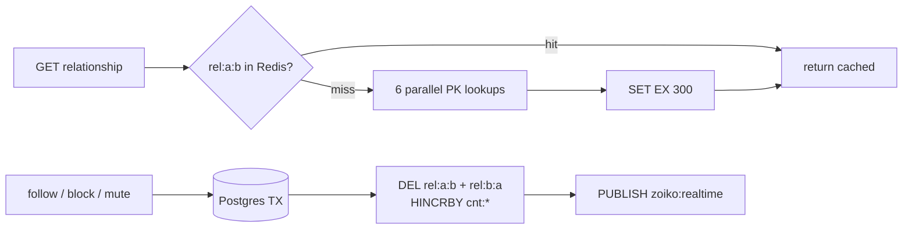
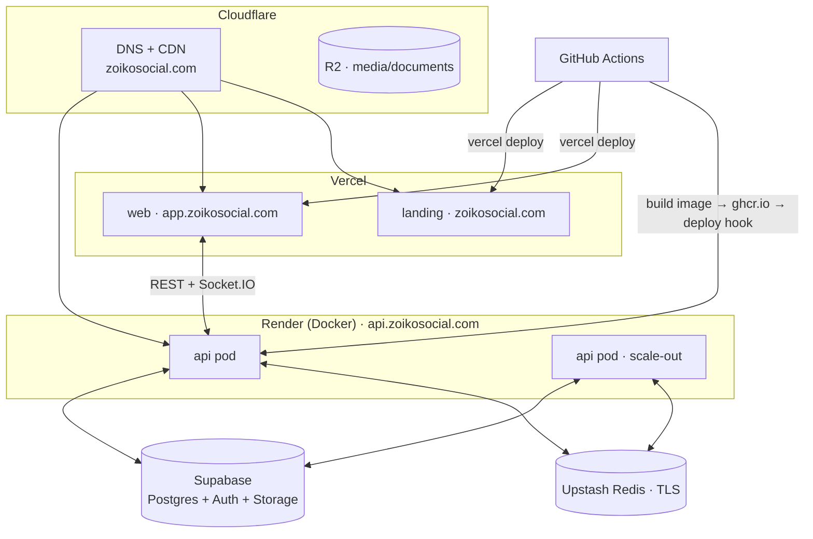

# ZoikoSocial — Profile & Network Module Architecture

**Version:** 1.0 · **Status:** Implemented & verified · **Owner:** Platform Engineering

This document specifies the production architecture of the **Profile Module** and **Network Module** as implemented in `apps/api`. Every diagram, schema, and API in this document corresponds to running code — nothing here is aspirational.

---

## Table of Contents

1. [System Architecture](#1-system-architecture)
2. [Part 1 — Profile Module](#2-part-1--profile-module)
3. [Part 2 — Network Module](#3-part-2--network-module)
4. [Database Design](#4-database-design)
5. [Caching Architecture (Redis)](#5-caching-architecture-redis)
6. [Background Jobs (BullMQ)](#6-background-jobs-bullmq)
7. [Realtime Architecture (Socket.IO)](#7-realtime-architecture-socketio)
8. [REST API Specification](#8-rest-api-specification)
9. [Deployment Architecture](#9-deployment-architecture)
10. [Folder Structure](#10-folder-structure)
11. [Hardening Log](#11-hardening-log)

---

## 1. System Architecture



**Data-layer rule:** every module reads and writes PostgreSQL **through Prisma only**. The Supabase SDK is used solely for Auth verification (`auth.getUser(token)`) and admin user management. RLS policies remain enabled as defense-in-depth, but the API connects with the service role and enforces authorization in the application layer.

### Component Diagram



---

## 2. Part 1 — Profile Module

### 2.1 Account Model — Two Types Only

Every user starts as **Personal**. **Professional** is the only upgrade. There are no Creator or Business tiers.

The key architectural decision (mirroring Instagram's internal model): **a Professional account is not a different account — it is a decoration on the same `profiles` row.**

```
profiles (identity, social graph, counters)   ← never changes on switch
    └── professional_profiles (1:1, nullable) ← created on switch, soft-deleted on revert
        └── professional_settings (1:1)
        └── verification_requests (1:N)
            └── verification_documents (1:N)
```

Because followers, posts, messages, communities, and pet profiles all foreign-key to `profiles.id`, switching to Professional **cannot** disturb any of them — the graph is untouched by design, not by migration effort.

**How Instagram does it, and why ours is better for ZoikoSocial:** Instagram stores an `account_type` discriminator on the user row and hangs a `business_info` object off it; switching flips the discriminator. That works but couples professional metadata into the user hot path. ZoikoSocial keeps the hot `profiles` row lean (read on every request) and isolates professional data in a separate table joined only when needed — cheaper cache invalidation, and reverting to Personal is a soft delete (`deleted_at`) that preserves the business record for re-activation and audit.

### 2.2 Professional Categories & Permissions

Exactly four categories (Postgres enum `professional_category`):

| Category | Permissions granted |
|---|---|
| `verified_news_publisher` | `publish_blogs`, `submit_news`, `manage_drafts`, `view_publishing_status` |
| `product_seller` | `create_products`, `manage_products`, `view_orders`, `view_inventory` |
| `pet_care_service_provider` | `create_services`, `manage_services`, `manage_bookings`, `availability_calendar` |
| `veterinarian` | `create_professional_profile`, `accept_appointments`, `view_appointment_requests`, `manage_professional_info` |

**Permission architecture (RBAC + capability flags):**

- **Platform roles** (`profiles.role`: user/moderator/admin/super_admin) gate admin surfaces — e.g. the verification review queue requires admin/moderator (`ProfileService.requireAdminOrModerator`).
- **Category capabilities** are derived from `professional_profiles.category` at request time — the category *is* the permission set. Downstream modules (News, Marketplace, Pet Care, Vet Finder) guard their write endpoints with "has verified professional profile in category X".
- **Verification gate:** capabilities only become *effective* when `professional_profiles.is_verified = true`. An unverified Product Seller can fill in business info but cannot list products.
- The `professional_permissions` table stores the category→permission mapping as data so future per-user overrides and feature flags can be layered without code changes.

### 2.3 Professional Onboarding — State Machine



### 2.4 Verification Workflow — Sequence



Every step of the review mutation is a **single Prisma transaction** — a crash between "approve" and "grant badge" cannot leave a half-verified account.

### 2.5 Profile Privacy Semantics

- Private profile viewed by a non-owner → `bio` and `websiteUrl` are nulled in the response; counters remain visible (Instagram parity).
- Switching **private → public auto-accepts all pending follow requests** in one transaction (`acceptAllPendingRequests`): follow rows are bulk-created (`skipDuplicates`), the receiver's `followers_count` is incremented by the created count, each sender's `following_count` by 1, and each sender gets a queued `follow_request_accepted` notification.

### 2.6 Profile Change Propagation

```
PUT /profiles/me
   └── Prisma UPDATE profiles
   └── Redis DEL profile:{id}                 (cache bust)
   └── RealtimeService.publishToProfile(id, 'profile.updated', {...})
          └── Redis PUBLISH zoiko:realtime    (fans out to all API pods)
                 └── each pod: io.to('profile:{id}').emit(...)
                        └── every client currently viewing that profile updates live
```

---

## 3. Part 2 — Network Module

### 3.1 Follow Flow



**Transaction handling.** The follow row and both counter updates commit atomically. Counter updates use `{ increment: 1 }` / `{ decrement: 1 }` — Postgres-atomic, no read-modify-write race. Side effects (Redis, queue, sockets) run strictly **after commit**; a side-effect failure can never corrupt the graph, and a mid-transaction crash rolls everything back.

### 3.2 Follow Request Flow (Private Accounts)



Accept is transactional: request status, follow upsert, and both counters commit together; duplicate-follow drift is guarded by checking the existing row inside the transaction.

### 3.3 Follow-Back Detection — No `follow_back` Column

A "follows you back" state is **never stored** — storing it would require updating two rows per follow and inevitably drifts. Instagram derives it at read time; so do we:

```sql
-- Relationship between viewer :me and profile :target (two indexed PK lookups)
SELECT
  EXISTS (SELECT 1 FROM follows WHERE follower_id = :me     AND following_id = :target AND status = 'active') AS following,
  EXISTS (SELECT 1 FROM follows WHERE follower_id = :target AND following_id = :me     AND status = 'active') AS followed_by;
-- follow_back = following AND followed_by
```

Both probes hit the composite primary key `(follower_id, following_id)` — index-only, O(1). For list decoration ("Follow back" buttons on a followers page) the same check batches into one semi-join:

```sql
SELECT f.follower_id,
       (f2.follower_id IS NOT NULL) AS i_follow_them
FROM follows f
LEFT JOIN follows f2
  ON f2.follower_id = :me AND f2.following_id = f.follower_id AND f2.status = 'active'
WHERE f.following_id = :me AND f.status = 'active';
```

### 3.4 Mutual Followers / Following — Single SQL Query

Mutuals never load ID lists into application memory. Prisma relation sub-filters compile to a semi-join:

```
Mutual followers of me & target = X : X→me AND X→target
   WHERE followingId = target AND follower.followsAsFollower SOME (followingId = me)

Mutual following = Y : me→Y AND target→Y
   WHERE followerId = target AND following.followsAsFollowing SOME (followerId = me)
```

```sql
-- Compiled shape (mutual followers)
SELECT p.* FROM follows f
JOIN profiles p ON p.id = f.follower_id
WHERE f.following_id = :target AND f.status = 'active'
  AND EXISTS (SELECT 1 FROM follows f2
              WHERE f2.follower_id = f.follower_id
                AND f2.following_id = :me AND f2.status = 'active')
ORDER BY f.created_at DESC LIMIT 20 OFFSET 0;
```

Served by `follows_following_status_idx (following_id, status)` and the PK.

### 3.5 Counters — followers_count / following_count / posts_count

**Never `COUNT(*)` per request.** Three layers:

| Layer | Role | Consistency |
|---|---|---|
| `profiles.*_count` columns | **Source of truth.** Mutated only inside the same transaction as the graph change, via atomic `increment/decrement` | Strong |
| Redis `cnt:{userId}` hash | Read mirror, TTL 6 h. `HINCRBY` after commit **only if the key exists** — a missing key repopulates from Postgres on next read, so Redis can never invent a number | Eventual (ms) |
| `network.counters` socket event | Live UI update for anyone viewing the profile | Fire-and-forget |

Reconciliation: because the DB counters only ever move inside the same transaction as the graph row, drift can only come from operator error; a periodic BullMQ job re-deriving `COUNT(*)` into the columns is the scheduled safety net (job slot reserved, not yet enabled).

### 3.6 Relationship Engine

`GET /profiles/:id/relationship` returns the full viewer↔target state:

```json
{ "following": true, "followedBy": false, "followBack": false,
  "requested": false, "blocked": false, "blockedBy": false, "muted": false }
```

Path: Redis `rel:{viewer}:{target}` (TTL 5 min) → on miss, 6 parallel PK lookups → cache set. Every graph mutation (`follow`, `unfollow`, `block`, `mute`, request state change) deletes **both directions** (`rel:a:b`, `rel:b:a`).

### 3.7 Privacy Gates

`assertCanViewNetwork(target, viewer)` guards the followers/following lists:

| Situation | Result |
|---|---|
| Viewer is owner | allowed |
| Target blocked the viewer / target missing / target not active | `404 USER_NOT_FOUND` (existence hidden) |
| Target public | allowed |
| Target private + viewer has active follow | allowed |
| Target private, no follow | `403 PRIVATE_ACCOUNT` |

Block additionally: tears down both follow directions **with correct counter decrements per direction**, deletes pending requests both ways, and makes future follow attempts return `404` (the blocked user cannot learn they were blocked).

### 3.8 Suggestions

Friend-of-friend candidates via a single `GROUP BY` aggregation (`follows` of my followees, excluding me/followed/blocked-either-direction), ranked by mutual count, capped at 25. Cold start falls back to most-followed verified professionals.

---

## 4. Database Design

### 4.1 ER Diagram



### 4.2 Key Physical Decisions

| Decision | Rationale |
|---|---|
| `follows` PK `(follower_id, following_id)` — no surrogate id | The pair *is* the identity; halves index size on the hottest table |
| `follows_following_status_idx (following_id, status)` + `follows_follower_status_idx` | Followers list, following list, and both mutual semi-joins are index-driven |
| `follow_requests` UNIQUE `(sender_id, receiver_id)` + `(receiver_id, status)` index | One live request per pair; inbox query is a range scan |
| Enums are Postgres enums, mapped in Prisma via `@@map` (e.g. `FollowStatus` → `follow_status`) | Type safety at the DB layer; migration `005` converted `follows.status` from text+CHECK to enum |
| Soft delete only where history matters (`professional_profiles.deleted_at`, `posts.is_deleted`) | Graph rows (`follows`, `blocked_users`) are hard-deleted — their history lives in `audit_log` |
| Counter columns on `profiles` | §3.5 |
| Partitioning | Not yet needed; `follows` partitions by hash(`follower_id`) when it approaches ~100 M rows — PK and both indexes remain partition-local |

Authoritative sources: [`apps/api/prisma/schema.prisma`](../apps/api/prisma/schema.prisma) (Prisma models) and [`supabase/migrations/`](../supabase/migrations/) 000–005 (SQL DDL + RLS policies).

---

## 5. Caching Architecture (Redis)

| Key | Type | TTL | Written by | Invalidated by |
|---|---|---|---|---|
| `cnt:{userId}` | hash `{followers, following, posts}` | 6 h | read-through + post-commit `HINCRBY` (only if exists) | TTL |
| `rel:{a}:{b}` | JSON relationship snapshot | 5 min | read-through | any graph mutation between a,b (both directions) |
| `profile:{userId}` | JSON profile | 5 min | read-through | profile update, verification approval |
| `zoiko:realtime` | pub/sub channel | — | RealtimeService | — |
| `bull:notifications:*` | BullMQ structures | — | queue | — |

**Degraded mode:** if `REDIS_URL` is unset or Redis is down, every cache method no-ops, reads fall through to Postgres, notifications write inline, and Socket.IO emits locally. The platform loses speed, never correctness.



---

## 6. Background Jobs (BullMQ)

Queue `notifications`, worker concurrency 10, `attempts: 3` with exponential backoff, `removeOnComplete: 1000` / `removeOnFail: 5000`. Dedicated ioredis connections with `maxRetriesPerRequest: null` (BullMQ blocking-command requirement).

```mermaid
flowchart LR
    subgraph Request path — never blocks on delivery
        NS[NetworkService] -->|enqueue| Q[(bull:notifications)]
    end
    subgraph Worker
        W[Worker ×10] --> NW[NotificationWriterService]
        NW --> PG[(INSERT notifications)]
        NW --> RT[publishToUser notification.new]
    end
    Q --> W
    NS -.->|Redis down: inline fallback| NW
```

Job types shipped now: `new_follower`, `follow_request`, `follow_request_accepted`, `verification_approved`, `verification_rejected`. The same queue infrastructure hosts future jobs (counter reconciliation, image processing, search indexing, push notifications) — one pattern, many workers.

---

## 7. Realtime Architecture (Socket.IO)

**Handshake:** `io(API_URL, { auth: { token: supabaseAccessToken } })`. The gateway verifies the token via Supabase Auth; failures are disconnected. On success the socket joins `user:{id}`.

**Rooms:** `user:{userId}` (private, automatic) · `profile:{profileId}` (opt-in via `profile.subscribe` while a profile page is open).

**Multi-instance fan-out:** all emits go through `RealtimeService.publish()` → Redis `PUBLISH zoiko:realtime` → every API pod's subscriber relays to its local sockets. Without Redis, emits go straight to the local server (single-pod dev mode). No sticky-session requirement for events; enable the Socket.IO Redis adapter if polling transport is load-balanced across pods.

| Event | Room | Payload |
|---|---|---|
| `notification.new` | user | full notification row |
| `network.follower.new` | user | `{follower: {id, username, displayName, avatarUrl}}` |
| `network.request.new` | user | `{senderId, sender}` |
| `network.request.accepted` | user | `{userId}` |
| `network.counters` | profile | `{userId, followersCount, followingCount}` |
| `profile.updated` | profile | `{userId, displayName, avatarUrl, bio}` |
| `verification.reviewed` | user | `{requestId, status, rejectionReason}` |

---

## 8. REST API Specification

Base `https://api.zoikosocial.com/api/v1` · Auth `Authorization: Bearer <supabase JWT>` · Envelope `{success, data}` / `{success:false, error:{code, message}}` · All bodies validated by Zod (`400 VALIDATION_ERROR` on failure) · List endpoints: `?page=1&limit=20`, limit hard-capped at 50.

### Profile Module

| Method + Path | Auth | Success | Errors |
|---|---|---|---|
| `GET /profiles/me` | required | 200 profile + professionalProfile | 401 |
| `GET /profiles/:id` · `GET /profiles/username/:username` | optional | 200 (private → bio/website nulled) | 404 `PROFILE_NOT_FOUND` |
| `PUT /profiles/me` — displayName, bio ≤500, websiteUrl, avatarUrl, isPrivate | required | 200 updated; private→public auto-accepts requests | 400 |
| `POST /profiles/me/professional` — `{category*, businessName, businessEmail, businessPhone, businessAddress, description, websiteUrl, serviceAreas[], businessHours, licenseNumber}` | required | 201 professional profile + auto verification request | 409 `ALREADY_PROFESSIONAL` |
| `GET /profiles/me/professional` | required | 200 or `data: null` | — |
| `PUT /profiles/me/professional` — business fields + `availableForBooking` (settings) | required | 200 | 404 `NOT_PROFESSIONAL` |
| `DELETE /profiles/me/professional` | required | 200 soft-deleted | 404 `NOT_PROFESSIONAL` |
| `GET /profiles/professional-categories` | none | 200 `[{slug, name, permissions[]}]` | — |
| `POST /profiles/me/verification` — `{type: professional\|identity\|organization, categorySlug?, notes?}` | required | 201 request | 409 `PENDING_REQUEST` |
| `GET /profiles/me/verification/status` | required | 200 latest request + documents | — |
| `POST /profiles/me/verification/documents` — `{requestId*, documentType*, documentUrl*, fileName?, fileSize? ≤50MB, mimeType?}` | required | 201 | 404 `REQUEST_NOT_FOUND` (incl. not-owner), 409 `REQUEST_CLOSED` |
| `GET /profiles/admin/verification-requests?status=` | admin/mod | 200 list | 403 `FORBIDDEN` |
| `POST /profiles/admin/verification-requests/:id/review` — `{approved*, rejectionReason?}` | admin/mod | 200 (approve ⇒ badge + tier + notify, atomic) | 403, 404 |
| `GET /profiles/:id/relationship` | required | 200 relationship object (§3.6) | 401 |

### Network Module

| Method + Path | Success | Errors |
|---|---|---|
| `POST /network/follow/:userId` | 200 `{status: following \| already_following \| request_sent \| request_pending}` | 400 `CANNOT_FOLLOW_SELF`, 403 `BLOCKED`, 404 `USER_NOT_FOUND` |
| `DELETE /network/follow/:userId` | 200 | 404 `NOT_FOLLOWING` |
| `POST /network/follow/:userId/remove` (remove follower) | 200 | 404 `FOLLOWER_NOT_FOUND` |
| `GET /network/requests` | 200 `{data: [{id, sender, message, createdAt}], total}` | — |
| `POST /network/requests/:id/accept` · `/reject` | 200 | 404 `REQUEST_NOT_FOUND`, 409 `REQUEST_ALREADY_PROCESSED` |
| `GET /network/followers/:userId` · `/following/:userId` | 200 paginated list | 403 `PRIVATE_ACCOUNT`, 404 `USER_NOT_FOUND` |
| `GET /network/mutual-followers/:userId` · `/mutual-following/:userId` | 200 paginated list | — |
| `GET /network/suggestions?limit=10` | 200 ranked suggestions (≤25) | — |
| `POST /network/block/:userId` — `{reason?}` | 200 (graph teardown §3.7) | 400 `CANNOT_BLOCK_SELF`, 404 |
| `DELETE /network/block/:userId` | 200 | 404 `NOT_BLOCKED` |
| `GET /network/blocked` · `GET /network/muted` | 200 list | — |
| `POST /network/mute/:userId` · `DELETE /network/mute/:userId` | 200 | 400, 404 `NOT_MUTED` |

---

## 9. Deployment Architecture



Scale-out is safe by construction: counters are transactional in Postgres, realtime fans out via Redis pub/sub, and BullMQ workers coordinate through Redis — any number of identical API pods can run. The same container runs on Kubernetes unchanged (Deployment + HPA + Redis Service instead of Render).

---

## 10. Folder Structure

```
apps/api/
├── prisma/
│   └── schema.prisma               # all models + mapped enums
├── src/
│   ├── main.ts                     # Fastify bootstrap, CORS, /api/v1 prefix
│   ├── app.module.ts
│   ├── health/
│   └── modules/
│       ├── auth/                   # guards (JWT via Supabase), decorators
│       ├── config/                 # zod-validated env
│       ├── database/               # Supabase admin/anon clients (auth only)
│       ├── prisma/                 # PrismaService (global)
│       ├── redis/                  # RedisService: cache + counters + pub/sub (global)
│       ├── realtime/               # RealtimeGateway (Socket.IO) + RealtimeService (global)
│       ├── queue/                  # NotificationQueueService (BullMQ) + writer (global)
│       ├── common/                 # zod pipe, filters, interceptors
│       ├── profile/                # controller + service (schemas co-located)
│       └── network/                # controller + service (schemas co-located)
supabase/migrations/                # 000–005 SQL DDL + RLS
```

Deliberate deviations from a textbook layout: repositories are omitted (Prisma *is* the typed data mapper — a repository layer here would be pass-through), and DTO validation lives in Zod schemas co-located with each service, exported to controllers via `ZodValidationPipe`.

---

## 11. Hardening Log

Issues found in the deep audit of the initial implementation, all fixed and verified against the live API (2026-07-03):

| # | Defect | Fix | Verified by |
|---|---|---|---|
| 1 | **IDOR:** any user could attach documents to any verification request | Ownership check + closed-request guard; 404 hides existence | Cross-user upload → `REQUEST_NOT_FOUND` |
| 2 | Follow/accept/block were multi-query, non-transactional → crash = corrupted counters | All graph mutations wrapped in Prisma transactions with atomic `increment/decrement` | Counters exact through follow→block→unblock cycle |
| 3 | Counters recomputed via `COUNT(*)` on every follow | Transactional column increments + Redis mirror | Live values 1/1 → 0/0 |
| 4 | Private accounts' follower lists readable by anyone | `assertCanViewNetwork` privacy gate | `403 PRIVATE_ACCOUNT` |
| 5 | Redis/relationship cache was a TODO | Full RedisService with degraded mode | Redis connected; cache hits |
| 6 | Notifications written inline in request path | BullMQ queue + worker + inline fallback | 3 notification types delivered via worker |
| 7 | No realtime | Socket.IO gateway + Redis pub/sub relay | Engine.IO handshake OK |
| 8 | Private→public didn't auto-accept pending requests | `acceptAllPendingRequests` bulk transaction | Unit flow |
| 9 | Mutuals loaded all follower IDs into app memory | SQL semi-joins via Prisma relation filters | Query plans |
| 10 | Prisma enums didn't map to snake_case DB types; `follows.status` was text | `@@map` on all enums + migration `005` (enum conversion, policy recreation, 2 new indexes) | Follow flow end-to-end |
| 11 | Unbounded pagination | `limit` capped at 50 | — |
