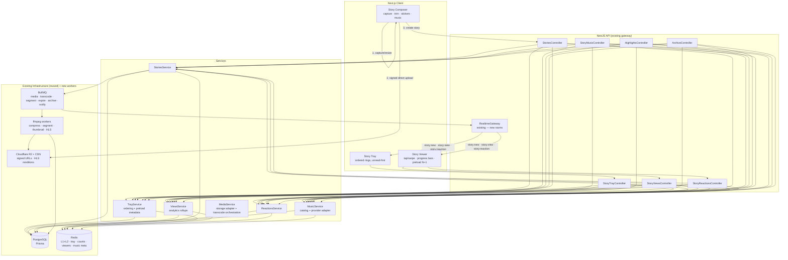
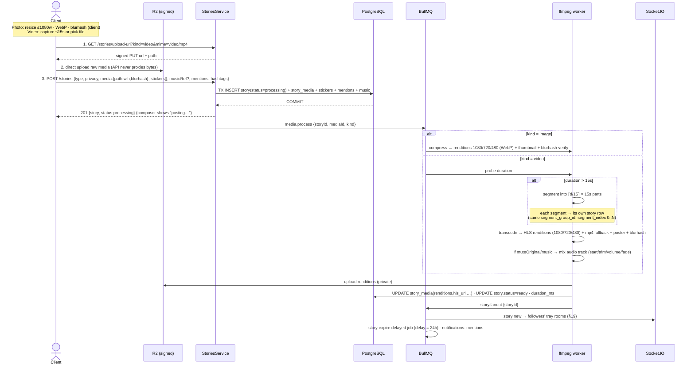
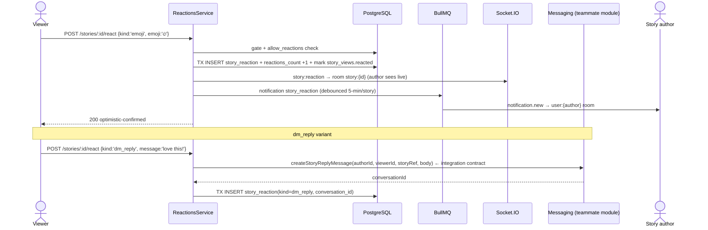
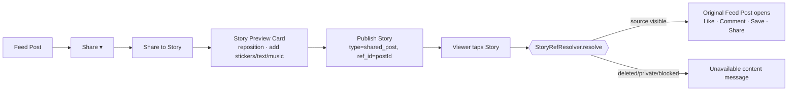
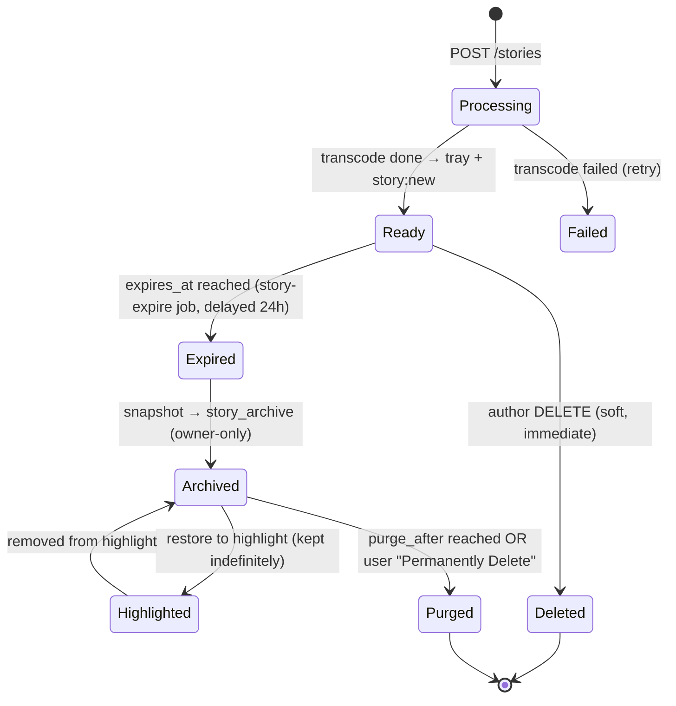
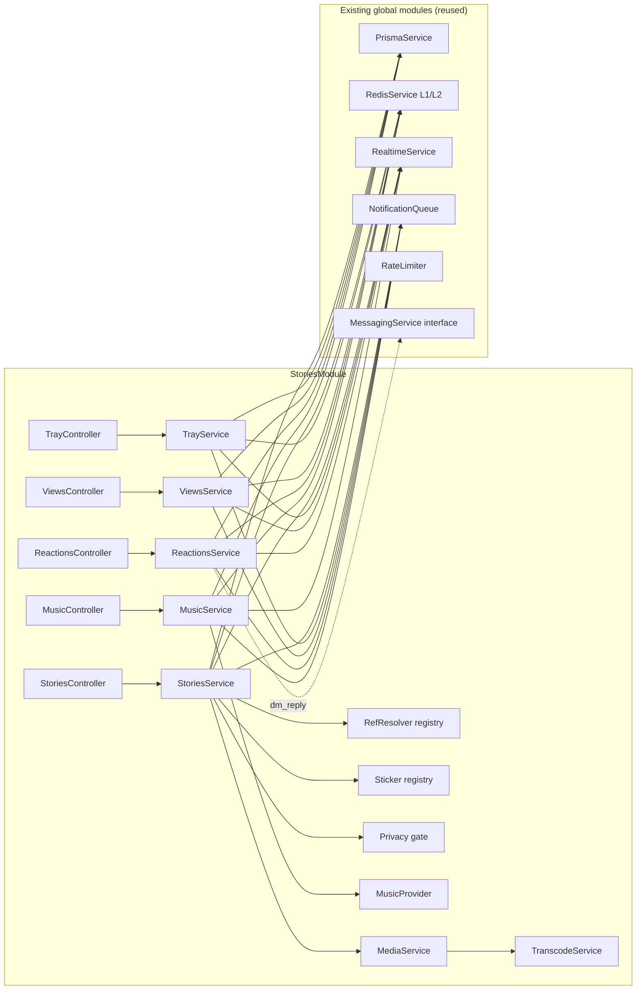
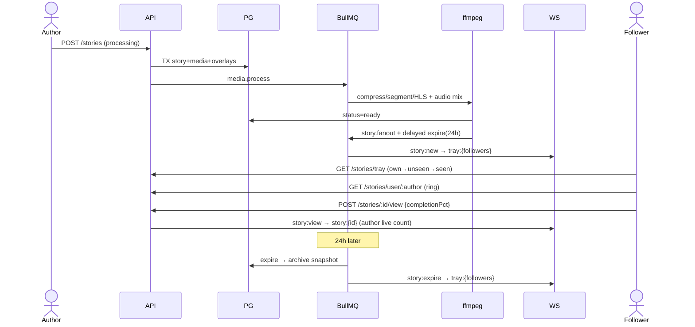

# ZoikoSocial — Stories Module Architecture

**Version:** 1.0 · **Status:** Design — ready for implementation · **Owner:** Platform Engineering
**Companions:** [feed-posts-architecture.md](./feed-posts-architecture.md) · [profile-network-architecture.md](./profile-network-architecture.md) · [communities-architecture.md](./communities-architecture.md) (all implemented & verified)

This document specifies the production architecture for the **Stories Module** — ephemeral 24-hour content inspired by Instagram Stories and WhatsApp Status, fully integrated with the existing Feed, Profiles, Network, Notifications, and Messaging modules.

It reuses every proven pattern from prior builds — transactional counters, L1/L2 Redis caching, viewer-context batch decoration, cursor pagination, BullMQ side-effects, Socket.IO rooms, the storage adapter, and the one-gate privacy model — and introduces exactly two genuinely new capabilities the platform does not yet have: **a video transcoding pipeline** and **a TTL-driven ephemeral lifecycle**. Everything else is composition of what already ships.

---

## Table of Contents

1. [System Overview](#1-system-overview)
2. [Story Types](#2-story-types)
3. [Database Design](#3-database-design)
4. [Media Pipeline (Upload · Compression · Segmentation · CDN)](#4-media-pipeline)
5. [Story Feed (Tray)](#5-story-feed-tray)
6. [Story Privacy & Permission Matrix](#6-story-privacy--permission-matrix)
7. [Viewer Analytics](#7-viewer-analytics)
8. [Reactions, Replies & Realtime](#8-reactions-replies--realtime)
9. [Share Feed/Profile/Product/Community to Story](#9-share-to-story-reference-model)
10. [Mentions](#10-mentions)
11. [Hashtags](#11-hashtags)
12. [Stickers (Extensible Registry)](#12-stickers-extensible-registry)
13. [Royalty-Free Music](#13-royalty-free-music)
14. [Story Highlights](#14-story-highlights)
15. [Story Archive & Lifecycle](#15-story-archive--lifecycle)
16. [Notifications](#16-notifications)
17. [Redis Strategy](#17-redis-strategy)
18. [BullMQ Strategy](#18-bullmq-strategy)
19. [Socket.IO Event Architecture](#19-socketio-event-architecture)
20. [Performance: Decisions & Rationale](#20-performance-decisions--rationale)
21. [REST API Specification](#21-rest-api-specification)
22. [Folder Structure](#22-folder-structure)
23. [Diagrams](#23-diagrams)
24. [Implementation Order](#24-implementation-order)

---

## 1. System Overview



**Core principles (carried over verbatim from Feed & Network):**

1. **PostgreSQL is the source of truth; counters are transactional columns** (`views_count`, `reactions_count`, `replies_count`) mutated atomically in the same transaction as the row change.
2. **Redis is a mirror, never an authority** — L1 in-process (15s) → L2 Upstash (short TTL) → Postgres. The story **tray** and **seen-set** are the hottest reads in the product and live primarily in Redis, but always rebuild from Postgres on miss.
3. **Side effects run post-commit** via BullMQ — transcode, segmentation, notifications, expiry, archive. A worker failure can never corrupt a story or its privacy.
4. **Viewer context is batch-decorated** — a tray page gets its `hasUnseen` / `seenCount` flags from set operations, never N+1.
5. **Every list is cursor-paginated** on `(created_at, id)` via the existing `cursor-pagination.ts` util.
6. **One privacy gate** (`assertCanViewStory`) runs on every read path — tray, viewer, single-story, analytics.

**What is genuinely new (and why it must be):**

| New capability | Why it can't reuse existing infra | Isolation |
|---|---|---|
| Video transcode + 15s segmentation + HLS renditions | Feed deferred video; Stories mandate ≤15s video with auto-split and adaptive playback | Behind `TranscodeService` + `media` worker; API never blocks on it (story publishes as `processing` → `ready`) |
| Ephemeral 24h TTL lifecycle | No existing content expires | `story-expire` repeatable queue + `expires_at` column; nothing else changes |
| Background music mixing | New media concern | `StoryMusic` join + `MusicProvider` adapter; audio delivered from R2/CDN |

---

## 2. Story Types

All seven types are **one `stories` row** with a `type` discriminator. Rich, self-contained media (photo/video/text) lives in `story_media`; the four *shared* types store **only a polymorphic reference** to the source entity — never a copy — matching the "share-to-story stores a reference" requirement.

| `story_type` | Media rows | Reference target | Renders as |
|---|---|---|---|
| `photo` | 1 image (multi-resolution) | — | full-bleed image + overlays |
| `video` | 1 video segment (HLS) | — | autoplay muted-then-sound, ≤15s |
| `text` | 0 (background gradient + text stored on story) | — | typographic card |
| `shared_post` | 0 | `feed_post` → `posts.id` | tappable preview card → opens post |
| `shared_professional_profile` | 0 | `profile` → `profiles.id` | profile mini-card → opens profile |
| `shared_marketplace_product` | 0 | `product` → `marketplace_products.id`¹ | product card (price/thumb) → opens PDP |
| `shared_community_post` | 0 | `community_post` → `posts.id` (community-scoped) | community post card → opens post |

¹ Marketplace tables are future (Commercial Platform module). The reference is polymorphic (`ref_type` + `ref_id`), so the shared-product type is **schema-ready today, activated when Marketplace ships** — no Stories migration required.

**Polymorphic reference resolution** happens at read time through a small resolver registry (mirrors the sticker registry, §12):

```ts
interface StoryRefResolver {
  type: StoryRefType                        // 'feed_post' | 'profile' | 'product' | 'community_post'
  resolve(refId: string, viewerId: string): Promise<StoryRefCard | UnavailableCard>
}
// If the target is deleted / private / blocked → returns UnavailableCard
// → viewer shows "This content is no longer available" (per requirement)
```

The story row keeps `ref_type`/`ref_id` **only**; resolution runs live against the source module's privacy gate. A deleted or newly-private source resolves to an `UnavailableCard` automatically — no dangling copies, no stale privacy.

---

## 3. Database Design

### 3.1 ER Diagram

```mermaid
erDiagram
    profiles ||--o{ stories : "author"
    stories ||--o{ story_media : "1 (or N video segments)"
    stories ||--o{ story_views : ""
    stories ||--o{ story_reactions : ""
    stories ||--o{ story_mentions : ""
    stories ||--o{ story_stickers : ""
    stories ||--o| story_music : "0..1"
    stories }o--o| posts : "shared_post ref (nullable)"
    profiles ||--o{ story_views : "viewer"
    profiles ||--o{ story_reactions : "reactor"
    profiles ||--o{ story_mentions : "mentioned"
    profiles ||--o{ story_highlights : "owner"
    story_highlights ||--o{ story_highlight_items : ""
    stories ||--o{ story_highlight_items : "archived snapshot"
    music_tracks ||--o{ story_music : ""

    stories {
        uuid id PK
        uuid author_id FK
        story_type type
        story_status status "processing|ready|failed"
        story_privacy privacy "public|followers|close_friends|professional"
        int segment_index "0 for single; N for split video"
        uuid segment_group_id "groups split video segments"
        text caption
        text background "text-story gradient/color json"
        story_ref_type ref_type "nullable — shared types"
        uuid ref_id "nullable — polymorphic"
        int duration_ms "photo=5000 default; video=actual"
        int views_count
        int reactions_count
        int replies_count
        int impressions_count
        boolean allow_replies
        boolean allow_reactions
        boolean is_archived
        boolean is_deleted "soft delete"
        timestamptz published_at
        timestamptz expires_at "published_at + 24h — indexed"
        timestamptz deleted_at
        timestamptz created_at
        timestamptz updated_at
    }
    story_media {
        uuid id PK
        uuid story_id FK
        story_media_type type "image|video"
        text hls_url "video: master.m3u8 (signed)"
        text mp4_fallback_url "video: progressive fallback"
        text image_url "image: largest rendition"
        jsonb renditions "resolution→path map"
        text thumbnail_url
        text preview_url "tiny poster / animated preview"
        text blurhash "instant placeholder"
        int width
        int height
        int duration_ms
        int file_size
        timestamptz created_at
    }
    story_views {
        uuid story_id PK_FK
        uuid viewer_id PK_FK
        int completion_pct "0..100"
        boolean reacted
        boolean replied
        boolean profile_visited
        timestamptz viewed_at
    }
    story_reactions {
        uuid id PK
        uuid story_id FK
        uuid user_id FK
        story_reaction_type kind "emoji|quick_reply|dm_reply|share|report"
        text emoji "nullable"
        text message "nullable — quick/dm reply body"
        uuid conversation_id "nullable — dm handoff to Messaging"
        timestamptz created_at
    }
    story_mentions {
        uuid id PK
        uuid story_id FK
        uuid mentioned_user_id FK
        uuid actor_id FK
        timestamptz created_at
    }
    story_stickers {
        uuid id PK
        uuid story_id FK
        sticker_type kind
        jsonb payload "type-specific data"
        jsonb transform "x,y,scale,rotation,z"
        timestamptz created_at
    }
    story_music {
        uuid story_id PK_FK
        uuid track_id FK
        int start_ms
        int duration_ms
        int volume "0..100"
        boolean fade_in
        boolean fade_out
        boolean mute_original
        timestamptz created_at
    }
    music_tracks {
        uuid id PK
        text title
        text artist
        text album
        text genre
        music_mood mood
        music_category category
        int duration_ms
        text cover_url
        text preview_url
        text audio_url "R2/CDN"
        text license
        text attribution
        text provider "internal|epidemic|… future"
        text provider_track_id
        boolean is_active
        timestamptz created_at
    }
    story_highlights {
        uuid id PK
        uuid owner_id FK
        text title
        text cover_url
        int position
        int items_count
        timestamptz created_at
        timestamptz updated_at
    }
    story_highlight_items {
        uuid id PK
        uuid highlight_id FK
        uuid archived_story_id FK
        int position
        timestamptz added_at
    }
    story_archive {
        uuid story_id PK_FK
        uuid owner_id FK
        jsonb snapshot "frozen story+media at expiry"
        timestamptz archived_at
        timestamptz purge_after "archived_at + retention"
    }
```

### 3.2 Prisma Models

```prisma
// PostType already has `story`; these enums are new.
enum StoryType {
  photo
  video
  text
  shared_post
  shared_professional_profile
  shared_marketplace_product
  shared_community_post

  @@map("story_type")
}

enum StoryStatus {
  processing   // media transcoding in flight — tray hides until ready
  ready
  failed

  @@map("story_status")
}

enum StoryPrivacy {
  public                 // anyone who can see the profile
  followers              // accepted followers (default)
  close_friends          // curated list (Instagram "Close Friends")
  professional           // followers of a professional/verified account audience

  @@map("story_privacy")
}

enum StoryRefType {
  feed_post
  profile
  product
  community_post

  @@map("story_ref_type")
}

enum StoryMediaType {
  image
  video

  @@map("story_media_type")
}

enum StoryReactionKind {
  emoji
  quick_reply
  dm_reply
  share
  report

  @@map("story_reaction_kind")
}

enum StickerType {
  emoji
  text
  gif
  mention
  hashtag
  time
  date
  weather     // future-ready
  poll        // future-ready
  question    // future-ready
  countdown   // future-ready

  @@map("sticker_type")
}

enum MusicMood {
  happy
  calm
  cinematic
  emotional
  travel
  nature
  pets
  funny
  inspirational
  background
  corporate
  ambient

  @@map("music_mood")
}

// Category shares the same value set today but is a distinct enum so the two
// axes can diverge later (e.g. a "workout" category with a "happy" mood).
enum MusicCategory {
  happy
  calm
  cinematic
  emotional
  travel
  nature
  pets
  funny
  inspirational
  background
  corporate
  ambient

  @@map("music_category")
}

model Story {
  id             String        @id @default(uuid())
  authorId       String        @map("author_id")
  type           StoryType
  status         StoryStatus   @default(processing)
  privacy        StoryPrivacy  @default(followers)
  segmentIndex   Int           @default(0) @map("segment_index")
  segmentGroupId String?       @map("segment_group_id")     // split-video grouping
  caption        String?       @db.VarChar(2200)
  background     Json?                                       // text story: {gradient|color, font, align}
  refType        StoryRefType? @map("ref_type")
  refId          String?       @map("ref_id")               // polymorphic — NO FK (cross-module)
  durationMs     Int           @default(5000) @map("duration_ms")
  viewsCount     Int           @default(0) @map("views_count")
  reactionsCount Int           @default(0) @map("reactions_count")
  repliesCount   Int           @default(0) @map("replies_count")
  impressionsCount Int         @default(0) @map("impressions_count")
  allowReplies   Boolean       @default(true) @map("allow_replies")
  allowReactions Boolean       @default(true) @map("allow_reactions")
  isArchived     Boolean       @default(false) @map("is_archived")
  isDeleted      Boolean       @default(false) @map("is_deleted")
  publishedAt    DateTime?     @map("published_at")
  expiresAt      DateTime?     @map("expires_at")
  deletedAt      DateTime?     @map("deleted_at")
  createdAt      DateTime      @default(now()) @map("created_at")
  updatedAt      DateTime      @updatedAt @map("updated_at")

  author    Profile          @relation(fields: [authorId], references: [id], onDelete: Cascade)
  media     StoryMedia[]
  views     StoryView[]
  reactions StoryReaction[]
  mentions  StoryMention[]
  stickers  StorySticker[]
  music     StoryMusic?
  highlightItems StoryHighlightItem[]

  // Tray query: author's active stories, chronological within a ring
  @@index([authorId, expiresAt])
  // Expiry sweep: due stories
  @@index([expiresAt])
  // Segment grouping for split video
  @@index([segmentGroupId, segmentIndex])
  @@map("stories")
}

model StoryMedia {
  id             String         @id @default(uuid())
  storyId        String         @map("story_id")
  type           StoryMediaType
  hlsUrl         String?        @map("hls_url")            // video master playlist
  mp4FallbackUrl String?        @map("mp4_fallback_url")
  imageUrl       String?        @map("image_url")          // largest image rendition
  renditions     Json?                                     // {"1080":"path","720":"…","480":"…"}
  thumbnailUrl   String?        @map("thumbnail_url")
  previewUrl     String?        @map("preview_url")        // tray poster / animated preview
  blurhash       String?
  width          Int?
  height         Int?
  durationMs     Int?           @map("duration_ms")
  fileSize       Int?           @map("file_size")
  createdAt      DateTime       @default(now()) @map("created_at")

  story Story @relation(fields: [storyId], references: [id], onDelete: Cascade)

  @@index([storyId])
  @@map("story_media")
}

model StoryView {
  storyId        String   @map("story_id")
  viewerId       String   @map("viewer_id")
  completionPct  Int      @default(0) @map("completion_pct")
  reacted        Boolean  @default(false)
  replied        Boolean  @default(false)
  profileVisited Boolean  @default(false) @map("profile_visited")
  viewedAt       DateTime @default(now()) @map("viewed_at")

  story  Story   @relation(fields: [storyId], references: [id], onDelete: Cascade)
  viewer Profile @relation(fields: [viewerId], references: [id], onDelete: Cascade)

  @@id([storyId, viewerId])                 // pair IS identity — dedup views, idempotent
  @@index([storyId, viewedAt(sort: Desc)])  // viewer list, newest first
  @@index([viewerId])                        // "which stories have I seen" fan-in
  @@map("story_views")
}

model StoryReaction {
  id             String            @id @default(uuid())
  storyId        String            @map("story_id")
  userId         String            @map("user_id")
  kind           StoryReactionKind
  emoji          String?
  message        String?           @db.VarChar(1000)
  conversationId String?           @map("conversation_id")   // set when dm_reply hands to Messaging
  createdAt      DateTime          @default(now()) @map("created_at")

  story Story   @relation(fields: [storyId], references: [id], onDelete: Cascade)
  user  Profile @relation(fields: [userId], references: [id], onDelete: Cascade)

  @@index([storyId, createdAt(sort: Desc)])
  @@index([userId])
  @@map("story_reactions")
}

model StoryMention {
  id              String   @id @default(uuid())
  storyId         String   @map("story_id")
  mentionedUserId String   @map("mentioned_user_id")
  actorId         String   @map("actor_id")
  createdAt       DateTime @default(now()) @map("created_at")

  story         Story   @relation(fields: [storyId], references: [id], onDelete: Cascade)
  mentionedUser Profile @relation("StoryMentioned", fields: [mentionedUserId], references: [id], onDelete: Cascade)
  actor         Profile @relation("StoryMentionActor", fields: [actorId], references: [id], onDelete: Cascade)

  @@unique([storyId, mentionedUserId])
  @@index([mentionedUserId, createdAt(sort: Desc)])
  @@map("story_mentions")
}

model StorySticker {
  id        String      @id @default(uuid())
  storyId   String      @map("story_id")
  kind      StickerType
  payload   Json                                 // type-specific: {tag} | {options[]} | {question} | {endsAt} …
  transform Json                                 // {x,y,scale,rotation,z}
  createdAt DateTime    @default(now()) @map("created_at")

  story Story @relation(fields: [storyId], references: [id], onDelete: Cascade)

  @@index([storyId])
  @@map("story_stickers")
}

model MusicTrack {
  id              String        @id @default(uuid())
  title           String
  artist          String
  album           String?
  genre           String
  mood            MusicMood
  category        MusicCategory
  durationMs      Int           @map("duration_ms")
  coverUrl        String        @map("cover_url")
  previewUrl      String        @map("preview_url")
  audioUrl        String        @map("audio_url")            // R2/CDN
  license         String
  attribution     String?
  provider        String        @default("internal")         // future: licensed providers
  providerTrackId String?       @map("provider_track_id")
  isActive        Boolean       @default(true) @map("is_active")
  createdAt       DateTime      @default(now()) @map("created_at")

  stories StoryMusic[]

  @@index([mood])
  @@index([category])
  @@index([genre])
  @@map("music_tracks")
}

model StoryMusic {
  storyId      String   @id @map("story_id")     // 0..1 per story → PK on storyId
  trackId      String   @map("track_id")
  startMs      Int      @default(0) @map("start_ms")
  durationMs   Int      @map("duration_ms")
  volume       Int      @default(100)
  fadeIn       Boolean  @default(false) @map("fade_in")
  fadeOut      Boolean  @default(false) @map("fade_out")
  muteOriginal Boolean  @default(false) @map("mute_original")
  createdAt    DateTime @default(now()) @map("created_at")

  story Story      @relation(fields: [storyId], references: [id], onDelete: Cascade)
  track MusicTrack @relation(fields: [trackId], references: [id], onDelete: Restrict)

  @@index([trackId])
  @@map("story_music")
}

model StoryHighlight {
  id         String   @id @default(uuid())
  ownerId    String   @map("owner_id")
  title      String   @db.VarChar(100)
  coverUrl   String?  @map("cover_url")
  position   Int      @default(0)
  itemsCount Int      @default(0) @map("items_count")
  createdAt  DateTime @default(now()) @map("created_at")
  updatedAt  DateTime @updatedAt @map("updated_at")

  owner Profile              @relation(fields: [ownerId], references: [id], onDelete: Cascade)
  items StoryHighlightItem[]

  @@index([ownerId, position])
  @@map("story_highlights")
}

model StoryHighlightItem {
  id              String   @id @default(uuid())
  highlightId     String   @map("highlight_id")
  archivedStoryId String   @map("archived_story_id")   // points at a story kept past expiry
  position        Int      @default(0)
  addedAt         DateTime @default(now()) @map("added_at")

  highlight StoryHighlight @relation(fields: [highlightId], references: [id], onDelete: Cascade)
  story     Story          @relation(fields: [archivedStoryId], references: [id], onDelete: Cascade)

  @@unique([highlightId, archivedStoryId])
  @@index([highlightId, position])
  @@map("story_highlight_items")
}

model StoryArchive {
  storyId    String   @id @map("story_id")
  ownerId    String   @map("owner_id")
  snapshot   Json                                     // frozen render payload at expiry
  archivedAt DateTime @default(now()) @map("archived_at")
  purgeAfter DateTime @map("purge_after")             // archivedAt + retention window

  owner Profile @relation(fields: [ownerId], references: [id], onDelete: Cascade)

  @@index([ownerId, archivedAt(sort: Desc)])
  @@index([purgeAfter])
  @@map("story_archive")
}
```

**Key physical decisions:**

| Decision | Why |
|---|---|
| `story_views` composite PK `(story_id, viewer_id)` | The pair is the identity — a viewer counts once; re-opens update `completion_pct` via UPSERT. Halves index size on the single hottest write table in the module. |
| `stories(expires_at)` index | The expiry sweep is a range scan `WHERE expires_at <= now()`; the tray filters `expires_at > now()`. One index serves both. |
| `ref_id` polymorphic, **no FK** | Points across module boundaries (posts, profiles, future marketplace). Referential integrity is enforced at *read* time by the resolver's privacy gate, not the DB — this is what makes shared-product schema-ready before Marketplace exists. |
| Split video = N rows sharing `segment_group_id` | A >15s upload becomes N stories in the author's ring; each is an independent viewable/analytics unit but they chain in playback. No separate "reel" concept needed. |
| `story_status` gate | Story inserts as `processing`; the tray only surfaces `ready`. Publishing never blocks on ffmpeg. |
| Soft delete on `stories` only | Views/reactions cascade-hard-delete; the archive holds the durable record. |
| `blurhash` + `preview_url` on media | Instant tray poster and viewer placeholder — the single biggest perceived-speed lever (§20). |
| `MusicTrack.provider` + `provider_track_id` | The whole catalog is behind a provider tag so licensed providers integrate later with **zero schema change** (requirement: "future-ready for commercial licensed providers"). |

**Migration:** `011_stories.sql` — all 11 tables + 9 enums, RLS policies mirroring the posts/follows precedent (authors write their own; viewers read per privacy gate via a security-definer function), the `expires_at` and `story_views` indexes, and `pg_trgm` reuse for music/hashtag search. `PostType.story` already exists — no change to `posts`.

---

## 4. Media Pipeline

Storage today is **Supabase Storage**; **Cloudflare R2 + CDN** is the stated target and is used here for **all story media and audio**. The existing `MediaStorage` adapter (from Feed) is extended — R2 is the active implementation for Stories from day one, Supabase remains for legacy buckets:

```ts
interface MediaStorage {
  createUploadUrl(userId, filename, mime): Promise<{ uploadUrl, publicUrl, path }>  // signed PUT
  createSignedReadUrl(path, ttlSeconds): Promise<string>                            // signed GET (private renditions)
  delete(paths: string[]): Promise<void>
}
// R2MediaStorage — S3-compatible presigned URLs; CDN in front for reads.
```

**Signed URLs:** story media is served through **short-lived signed CDN URLs** (default 1h read TTL, refreshed on tray hydration). Blocked users never receive a URL because the tray/viewer gate runs before any URL is minted — the signature is the *last* line of defense, the privacy gate is the first.

### 4.1 Upload & Processing Flow



### 4.2 Processing requirements (all handled in the `media` + `transcode` workers)

| Requirement | Implementation |
|---|---|
| Max video 15s | Probe with ffprobe; enforce per-segment |
| Auto-split >15s | `ffmpeg -f segment -segment_time 15` → N story rows sharing `segment_group_id` |
| Image compression | sharp/ffmpeg → WebP q0.82, strip EXIF |
| Video compression | H.264 (+AV1 future) CRF 23, `-preset veryfast`, cap bitrate per rendition |
| Thumbnail generation | first-frame (video) / downscale (image) → `thumbnail_url` |
| Preview generation | 2s animated webp (video) / LQIP (image) → `preview_url` for the tray |
| Multiple resolutions | 1080p / 720p / 480p renditions; HLS master playlist for video |
| Signed URLs | `createSignedReadUrl` per rendition, 1h TTL |
| CDN delivery | R2 + CDN, `Cache-Control: immutable` on renditions (content-addressed paths) |

**Failure handling:** if transcode fails after retries, `story.status = failed`; the author sees a "couldn't post — retry" state; the story never enters anyone's tray. Orphaned R2 objects (upload with no `ready` story after 1h) are swept by the maintenance queue.

---

## 5. Story Feed (Tray)

### 5.1 Ordering (exact requirement mapping)

The tray is an **ordered list of rings**, one per author who has ≥1 active `ready` story the viewer may see:

```
1. Own ring            → ALWAYS first (even with 0 stories → "＋ Your Story")
2. Unread rings        → authors with ≥1 story the viewer hasn't seen,
                         sorted by most-recent-story DESC
3. Viewed rings        → all seen, sorted by most-recent-story DESC
```

`hasUnseen` per ring = `ring.latestStoryAt > lastSeen(viewer, author)` OR set-difference of the ring's story ids against the viewer's seen-set (`seen:{viewerId}` Redis SET, §17). Within a ring, segments/stories play oldest→newest.

### 5.2 Serving pipeline

```
GET /stories/tray
  1. Candidate authors  → followees with active stories:
                          Redis ZSET author-activity ∩ my following set
                          (miss → SQL: authors in my follow set WHERE EXISTS active story)
  2. Ring hydration     → story:tray:{authorId} L2 cache (ordered ready story ids + poster/blurhash)
  3. Seen decoration    → SMEMBERS seen:{viewerId} → mark each ring hasUnseen + per-story seen
  4. Ordering           → own → unseen(recent desc) → seen(recent desc)
  5. Response           → { rings:[{author, hasUnseen, stories:[{id,type,poster,blurhash,duration}]}] }
```

The tray payload is **light** — ids, posters, blurhashes, durations. Full media (HLS/renditions) is fetched lazily by the viewer, only for the ring being opened.

### 5.3 Viewer behavior (Instagram-parity, minimal latency)

- **Preload only next 1–2** — when viewing story *i*, prefetch media for *i+1* (and *i+2* if bandwidth allows). Everything else lazy-loads on demand. Explicit requirement; prevents burning bandwidth on stories never reached.
- **Progressive media loading** — blurhash paints instantly → thumbnail → full rendition; video shows poster → buffers first HLS segment → plays.
- **Adaptive video** — HLS lets the player pick 480/720/1080 by bandwidth; starts at a low rendition for instant playback, ramps up.
- **Smooth transitions & fast swipe** — segments are independent media units; tap-right/left and swipe-down-to-close are gesture-driven with the next segment already warm.
- **Progress bars** — one per story in the ring; auto-advance on `duration_ms` (photo 5s default, video actual).
- **Optimistic view + reaction** — the `story:view` and reactions post fire-and-forget; UI never waits (§20).
- **Buffering optimization** — first HLS segment kept short (2–3s) so playback starts before the full 15s downloads.

---

## 6. Story Privacy & Permission Matrix

One gate at every entry (tray, viewer, single-story, analytics, reaction, reply):

```ts
async assertCanViewStory(story, viewerId): void
// blocked either direction              → 404 STORY_NOT_FOUND (existence hidden)
// author suspended / story is_deleted   → 404
// story.status != ready                 → 404 (unless viewer === author)
// story.expires_at <= now              → 404 (expired → gone from public surface)
// privacy = public                      → allow if viewer can see profile
// privacy = followers                   → allow if accepted follower (or author)
// privacy = close_friends               → allow if in author's close_friends list
// privacy = professional                → allow if follower AND author is professional/verified
// author is self                        → always allow (own story + analytics)
```

### 6.1 Permission matrix

| Viewer ↓ / Story privacy → | Public | Followers | Close Friends | Professional |
|---|---|---|---|---|
| Anonymous | ✅ (public profile only) | ❌ 404 | ❌ 404 | ❌ 404 |
| Authenticated, not following | ✅ | ❌ 404 | ❌ 404 | ❌ 404 |
| Accepted follower | ✅ | ✅ | ❌ 404 (unless listed) | ✅ (if author professional) |
| Close-friend follower | ✅ | ✅ | ✅ | ✅ |
| **Blocked (either direction)** | ❌ 404 | ❌ 404 | ❌ 404 | ❌ 404 |
| Author | ✅ + analytics/delete | ✅ | ✅ | ✅ |

**Blocked users never access stories** — enforced at candidate-selection (they never enter the tray) *and* at the per-story gate (direct URL 404s) *and* at URL-minting (no signed URL). Three layers, the gate being authoritative. Private accounts' `followers`/`close_friends` stories return 404 (never 403 — existence is not confirmed), matching the Feed module.

Batch form for the tray: candidate authors are intersected against the viewer's follow/close-friends/block sets in Redis before any per-story work — the same decoration pattern as feed hydration.

---

## 7. Viewer Analytics

Every open writes/updates a `story_views` row (UPSERT on the composite PK — idempotent, one row per viewer):

```
POST /stories/:id/view  { completionPct }
→ UPSERT story_views (completion_pct = GREATEST(existing, new))
→ if new row: stories.views_count +1 (TX)
→ always: stories.impressions_count +1 (impressions ≥ views; re-opens count)
→ HINCRBY cnt:story:{id} views/impressions (mirror)
→ WS story:view → author's story:{id} room (live viewer count)
```

| Metric | Definition | Source |
|---|---|---|
| **View count** | distinct viewers | `views_count` (distinct rows) |
| **Viewer list** | who viewed, newest first | `GET /stories/:id/viewers` — cursor, follower-decorated |
| **View timestamps** | per viewer | `story_views.viewed_at` |
| **Completion %** | max fraction watched | `story_views.completion_pct` |
| **Reach** | distinct accounts reached (across a segment group) | distinct viewers over `segment_group_id` |
| **Impressions** | total opens incl. re-views | `impressions_count` |

**Professional accounts** additionally get an **insights** payload (only when `author.verificationTier` is professional/verified):

| Pro metric | Source |
|---|---|
| Story Insights (aggregate) | rollup over the segment group |
| Engagement | reactions + replies + shares / reach |
| Replies | `story_reactions` where kind ∈ {quick_reply, dm_reply} |
| Profile Visits from Story | `story_views.profile_visited` (set when viewer taps author avatar → profile) |

Viewer list is **author-only** (`GET /stories/:id/viewers` gated to `viewer === author`). Analytics reads hit the `cnt:story:{id}` Redis mirror first; the viewer *list* is always a fresh indexed query (`story_views(story_id, viewed_at DESC)`).

---

## 8. Reactions, Replies & Realtime

All five reaction kinds are `story_reactions` rows with a `kind` discriminator:

| Kind | Effect | Realtime | Notification |
|---|---|---|---|
| `emoji` | quick emoji tap (❤️😂😮😢👏🔥) | `story:reaction` → author room | `story_reaction` (debounced) |
| `quick_reply` | preset text ("Nice!", "😍") | `story:reply` → author room | `story_reply` |
| `dm_reply` | free-text reply → **hands off to Messaging** (creates/【uses】 a DM conversation, stores `conversation_id`) | Messaging module's own events | `story_reply` |
| `share` | re-share this story (if author allows) | — | `story_shared` |
| `report` | safety report → Safety/Moderation queue | — | none (moderation-side) |



**Realtime architecture** rides the **existing single authed gateway + rooms** (no new namespace — same decision as Feed): `story:{id}` room for the author watching live reactions/views; `tray:{userId}` room for new-story pushes. All emissions go through `RealtimeService.publish()` → Redis pub/sub (multi-pod safe). Reactions are **optimistic** on the client and reconciled on ack.

**Messaging integration contract** (per `team_ownership.md` — Messaging is teammate-owned): Stories calls a documented `MessagingService.createStoryReply({fromUserId, toUserId, storyRef, body})` that returns a `conversationId`. Stories **never** writes messaging tables directly — it depends on the interface. Until that method lands, `dm_reply` degrades to a `quick_reply` notification (feature-flag `STORY_DM_REPLY`).

---

## 9. Share-to-Story (Reference Model)

Sharing a feed post (or profile / product / community post) to a story stores **only a reference** — never a copy — exactly as required.

### 9.1 Navigation flow



### 9.2 Storage & resolution

- `POST /stories` with `{type:'shared_post', refType:'feed_post', refId:<postId>}` — **no media rows**, no caption duplication. Optional overlays (stickers/text/music) still attach.
- At view time the resolver calls the source module's existing privacy gate (`PostsService.assertCanViewPost` for `feed_post`/`community_post`, `ProfilesService` for `profile`, future `MarketplaceService` for `product`).
- **Available** → returns a compact `StoryRefCard` (thumb, author, snippet, deep-link). Tapping opens the real entity where all native actions (like/comment/save/share) work against the live source.
- **Unavailable** (deleted, gone private, author blocked) → `UnavailableCard` → viewer sees "This content is no longer available." The story itself stays valid; only the embedded reference degrades.

This guarantees: zero data duplication, always-live privacy (a post that goes private instantly stops resolving), and no dangling copies when the source is deleted.

---

## 10. Mentions

- Added via a **mention sticker** or parsed from caption `/@([a-z0-9._]{3,30})/g`, resolved through the existing cached username→id map (invalid usernames dropped).
- **Username suggestions while typing** reuse `GET /network/search` (trigram-indexed, viewer-decorated) — the same autocomplete as the post composer.
- Rows in `story_mentions` (unique per `(story, user)`); notification job per mention (`story_mention`, deep-links to the story) — skipped for self and for users who blocked the author.
- **Clickable** — rendered mention sticker/text → `/profile/{username}`.
- Mentioned users optionally get a "you were mentioned" affordance to re-share to their own story (Instagram behavior) — a `shared_post`-style flow reusing §9.

---

## 11. Hashtags

- Added via a **hashtag sticker** or parsed from caption `/#([\p{L}\p{N}_]{1,50})/gu`, lowercased, deduped.
- **Reuses the Feed module's `hashtags` + `post_hashtags` normalization** — a story hashtag upserts the same `hashtags` row and links through a `story_hashtags` join (mirror of `post_hashtags`), so **trending is unified across posts and stories** (the existing `trend:hashtags` ZSET gets story contributions too).
- **Clickable** → `/explore/tags/{tag}`; that page already lists posts and now interleaves active public stories for the tag (privacy-gated).
- **Hashtag search** reuses the Feed `GET /hashtags/search` (prefix + pg_trgm).
- **Trending integration** — story usage `ZINCRBY`s the same decayed 48h set; no separate trending system.

---

## 12. Stickers (Extensible Registry)

All stickers are `story_stickers` rows: a `kind` enum + a **type-specific `payload` JSONB** + a `transform` JSONB (position/scale/rotation/z-order). The **core Stories module knows nothing about individual sticker semantics** — it stores and renders position; each sticker type registers a handler:

```ts
interface StickerHandler {
  kind: StickerType
  validate(payload: unknown): StickerPayload      // Zod per type
  hydrate(payload, viewerId): Promise<RenderData>  // e.g. weather → fetch; countdown → remaining; poll → tallies
  onInteract?(storyId, viewerId, action): Promise<void>  // poll vote, question answer
}
// Registry keyed by kind. Adding `weather`/`poll`/`question`/`countdown` = new handler + enum value.
// The stories table, upload flow, viewer, and analytics are UNCHANGED. (Requirement met.)
```

| Sticker | Status | Payload |
|---|---|---|
| emoji, text, gif | now | `{emoji}` / `{text,font,color}` / `{gifUrl,provider}` |
| mention, hashtag | now | `{userId,username}` / `{tag}` |
| time, date | now | `{format,tz}` — hydrated at render |
| weather | future-ready | `{location}` → handler fetches |
| poll | future-ready | `{question, options[]}` + interaction tallies |
| question | future-ready | `{prompt}` + response inbox |
| countdown | future-ready | `{title, endsAt}` — client renders remaining |

GIF stickers pull from a royalty-free GIF provider behind the same adapter pattern as music. Interactive stickers (poll/question/countdown) get their own tiny result tables when built — additive, no core change.

---

## 13. Royalty-Free Music

**Royalty-free only. No copyrighted commercial music.** The entire catalog is behind a `MusicProvider` adapter so licensed providers can be added later **without redesigning Stories**.

### 13.1 Provider adapter (future-ready)

```ts
interface MusicProvider {
  name: string                                   // 'internal' | 'epidemic' | 'artlist' (future)
  search(q: MusicQuery): Promise<MusicTrack[]>
  getTrack(id: string): Promise<MusicTrack>
  streamUrl(trackId: string, ttl: number): Promise<string>   // signed R2/CDN or provider CDN
}
// InternalMusicProvider (now): curated royalty-free catalog in music_tracks, audio on R2.
// LicensedMusicProvider (future): same interface, provider CDN + license enforcement.
```

`MusicTrack.provider` + `provider_track_id` already tag origin (§3.2) — swapping/adding a provider is config + a new adapter, never a schema migration.

### 13.2 Catalog data (per track)

Track ID · Title · Artist · Album (opt) · Genre · Mood · Duration · Cover Artwork · Preview Clip · Audio URL · License · Attribution (if applicable) — all columns present in `music_tracks`.

**Categories/moods** (enums): happy · calm · cinematic · emotional · travel · nature · pets · funny · inspirational · background · corporate · ambient.

### 13.3 Search & caching

| Endpoint | Search axis | Cache |
|---|---|---|
| `GET /music/search?q=` | title/artist (pg_trgm) | `music:search:{hash}` 5m L2 |
| `GET /music?mood=` `?genre=` `?category=` `?duration=` | indexed filters | `music:facet:{k}:{v}` 1h L2 |
| `GET /music/:id` | single track meta | `music:track:{id}` 24h L1+L2 |
| `GET /music/trending` | most-used in stories (ZSET) | Redis ZSET |

**Music metadata cached in Redis** (requirement) — the catalog is read-heavy and near-static, so track metadata gets a long TTL (24h) with explicit invalidation on catalog admin edits. Audio bytes are **never** in Redis — they stream from **R2 + CDN** via signed URLs.

### 13.4 Editing (composer)

Trim · start at any timestamp · adjust volume (0–100) · fade in · fade out · mute original video audio · mix original + background · replace before publishing — all captured in `story_music` (`start_ms`, `duration_ms`, `volume`, `fade_in`, `fade_out`, `mute_original`). The **actual audio mix is applied in the transcode worker** (§4.1) so the published HLS already contains the final audio — the viewer streams one clean file, no client-side mixing at playback.

### 13.5 Playback flow

```
Composer: pick track → preview (streamUrl, low-TTL) → set trim/volume/fade → attach story_music
Publish:  transcode worker mixes audio into the video's HLS (or attaches to photo/text as an audio track)
View:     player streams the final rendition from CDN — music already baked in, gapless
```

Attribution (when the license requires it) is rendered as a non-removable credit sticker on the story and recorded in analytics.

---

## 14. Story Highlights

Highlights are **curated, permanent collections separate from active stories** — they survive the 24h expiry by pointing at stories kept past expiry.

- `POST /highlights {title, coverUrl?}` → `story_highlights` row.
- **Add item** — `POST /highlights/:id/items {archivedStoryId}` links a story (must be author's, live or archived). Adding a soon-to-expire story flags it so the expiry job **archives instead of purges** it (§15).
- **Cover** (`cover_url`), **Title** (≤100), **Reorder** (`position` on both highlight and items), **Remove item**, **Archive story** (move to archive without a highlight).
- Highlights render on the profile as persistent circles (Instagram parity), each opening into a story-viewer session over its items.
- Fully **future-ready**: the tables and endpoints exist; the module ships them as an additive phase after core stories.

---

## 15. Story Archive & Lifecycle

Expired stories are **not immediately deleted** — they move to a **private archive** (owner-only), preserving the option to restore to highlights.



**Lifecycle mechanics:**

- On publish, a **delayed `story-expire` job** is enqueued with `delay = 24h` (BullMQ delayed job; `expires_at` is the backstop the sweep also checks — belt-and-suspenders against a dropped delayed job).
- **Expire job**: sets `is_archived=true`, writes a `story_archive` snapshot (frozen render payload + media paths), removes the story from all tray/seen Redis structures, emits `story:expire`. Media stays in R2 (the archive/highlight may still need it).
- **Archive**: `GET /me/archive` — owner-only, cursor-paginated. Actions: **View**, **Restore to Highlight**, **Permanently Delete**.
- **Purge**: `purge_after` (archive retention, e.g. archived_at + configurable window) → `story-cleanup` job hard-deletes the story + R2 media **unless** it's referenced by a highlight item.
- A story pinned to a **highlight** is exempt from purge as long as the link exists.

---

## 16. Notifications

Reuses the existing notification writer (free-text `type`, `data` JSON) + Socket.IO delivery — no new infrastructure:

| Type | Trigger | Body | Dedupe/throttle |
|---|---|---|---|
| `story_mention` | @you in a story | "X mentioned you in their story" | 1 per actor+story |
| `story_reply` | quick/dm reply to your story | "X replied to your story: '…'" | none |
| `story_reaction` | emoji reaction on your story | "X reacted 🔥 to your story" / "X and N others…" | 5-min collapse per story |
| `story_shared` | someone shares your story | "X shared your story" | 5-min collapse |

All carry `data: {storyId, actorUsername, kind?}` and deep-link into the story viewer / archive. Self-actions never notify; blocked-either-direction suppresses at enqueue. Enqueued to the **existing `notifications` queue**; delivered via `notification.new` on the `user:{id}` room.

---

## 17. Redis Strategy

Through the existing `RedisService` (L1 15s → L2 Upstash), same degraded-mode guarantees. Stories lean on Redis harder than any prior module because the tray + seen-set are the highest-QPS reads:

| Key | Type | TTL | Written | Invalidated |
|---|---|---|---|---|
| `story:{id}` | JSON story + media + author snapshot | 5m (or until expiry) | read-through | edit/delete · status→ready |
| `story:tray:{authorId}` | JSON ordered ready story ids + posters/blurhash | until next story or expiry | on publish/expire | new story · delete · expire |
| `seen:{viewerId}` | SET of seen story ids | 25h (> story lifetime) | on view | auto-expires with stories |
| `author-activity` | ZSET authorId→latestStoryMs | rolling | on publish | expire job ZREM when ring empties |
| `cnt:story:{id}` | hash {views, impressions, reactions, replies} | 25h | post-commit HINCRBY (exists-only) | TTL / reconciliation |
| `story:viewers:{id}` | not cached — always fresh indexed query (author-only, correctness > cache) | — | — | — |
| `music:track:{id}` / `music:facet:*` / `music:search:*` | JSON | 24h / 1h / 5m | read-through | catalog admin edit |
| `trend:hashtags` (shared with Feed) | ZSET | rolling | story+post ZINCRBY | 15-min decay job |

**Invalidation philosophy (unchanged):** counters mutate transactionally in Postgres and are *mirrored* with exists-only HINCRBY; caches are deleted, never patched; anything missing repopulates from source. The **seen-set TTL (25h) is deliberately longer than the 24h story lifetime** so a viewer's seen state naturally ages out exactly as the stories it references expire — no explicit cleanup needed. The reconciliation job recomputes `views_count/reactions_count/replies_count` as the drift backstop.

---

## 18. BullMQ Strategy

Extends the existing queue module (same connection factory, `ENABLE_WORKERS` flag, inline fallback). Media queues run on a **dedicated worker pod with ffmpeg** installed:

| Queue | Jobs | Consumer behavior |
|---|---|---|
| `story-upload` | `process {storyId, mediaId, kind}` — dispatch to image/video path | concurrency 4 |
| `image-optimization` | compress → renditions 1080/720/480 + thumbnail + blurhash | concurrency 4 (sharp) |
| `video-compression` | transcode → HLS renditions + mp4 fallback + poster; audio mix | concurrency 2 (ffmpeg, CPU-heavy) |
| `video-segmentation` | split >15s into ⌈d/15⌉ story rows (runs before compression per segment) | concurrency 2 |
| `thumbnail-generation` | poster/preview extraction (shared step) | concurrency 4 |
| `story-expiration` | delayed 24h job: archive snapshot + tray/redis cleanup + `story:expire` | concurrency 3 |
| `story-archive` | move expired → `story_archive`; exempt highlighted | concurrency 3 |
| `story-cleanup` | purge past `purge_after` (unless highlighted) + R2 media delete | concurrency 2, repeatable |
| `notifications` (existing) | story_mention · story_reply · story_reaction (debounced) · story_shared | existing writer → DB + Socket.IO |

**Worker architecture:**

```mermaid
graph TB
    API[API pods<br/>ENABLE_WORKERS=false] -->|enqueue| RD[(Upstash Redis<br/>BullMQ)]
    RD --> W1[Worker pod: general<br/>expire·archive·cleanup·notify]
    RD --> W2[Worker pod: media (ffmpeg)<br/>compress·segment·thumbnail·HLS]
    W1 & W2 --> PG[(PostgreSQL)]
    W2 --> R2[(Cloudflare R2 + CDN)]
    W1 --> GW[Socket.IO relay]
```

The **media worker is horizontally scalable and isolated** — a transcode backlog never affects API latency or the general worker. Delayed expiry jobs use BullMQ's native `delay`; the `expires_at` index + a low-frequency sweep is the safety net for any dropped delayed job.

---

## 19. Socket.IO Event Architecture

**No new namespace** — the existing single authed gateway + rooms (same decision as Feed/Network). Payloads carry ids + deltas; clients patch local state.

| Room | Joined when | Events |
|---|---|---|
| `user:{id}` (existing, auto) | connect | `notification.new` (all story notifications) |
| `tray:{userId}` | client on home/tray (`tray.subscribe`) | `story:new` {authorId} → insert/mark ring unseen · `story:expire` {storyId, authorId} → drop from ring |
| `story:{id}` | author viewing own story insights (`story.subscribe`) | `story:view` {viewerId, viewsCount} · `story:reaction` {emoji, count} · `story:reply` {preview} |

| Event | Direction | When |
|---|---|---|
| `story:new` | server→followers' `tray` | story reaches `ready` |
| `story:view` | server→author `story:{id}` | a viewer opens (live count) |
| `story:reply` | server→author `story:{id}` + `notification.new` | quick/dm reply |
| `story:reaction` | server→author `story:{id}` + `notification.new` | emoji reaction |
| `story:update` | server→viewers `story:{id}` | edit (rare — caption/stickers pre-publish only) |
| `story:delete` | server→followers `tray` | author deletes |
| `story:expire` | server→followers `tray` | 24h lapse (archived) |
| `story:highlight` | server→owner | added to a highlight (own-device sync) |

All via `RealtimeService.publish()` → Redis pub/sub relay (multi-pod safe). `story:new` is emitted only after transcode completes (never for a `processing` story) so a follower never taps into an unready ring.

---

## 20. Performance: Decisions & Rationale

Target: **Instagram-like instant opens, minimal buffering, millions of daily views.** Every optimization below maps to a stated requirement with its reason.

| Optimization | How | Why it's chosen |
|---|---|---|
| **Story opens almost instantly** | tray payload is ids + blurhash + poster only; media fetched lazily per opened ring | The tray is the highest-QPS read; keeping it tiny + Redis-served makes the ring open before the network round-trip for full media returns |
| **Progressive image loading** | blurhash → thumbnail → full rendition | Blurhash is 20 chars; it paints a recognizable placeholder in <1ms, eliminating perceived blank time — biggest speed-per-byte lever |
| **Adaptive video loading** | HLS with 480/720/1080 renditions; start low, ramp | Playback begins on the smallest segment instantly; the player upgrades quality as bandwidth allows — no fixed-bitrate stall on slow networks |
| **Minimal buffering** | short first HLS segment (2–3s); poster shown during buffer | Play starts before the whole 15s downloads |
| **Preload only next 1–2** | prefetch media for i+1 (and i+2 if bandwidth) | Explicit requirement — warms the very next story without wasting bandwidth on stories never reached |
| **Lazy-load remaining** | rings/segments beyond the window fetch on demand | A user rarely watches every ring; loading all upfront wastes bandwidth and CPU |
| **Efficient Redis caching** | tray, seen-set, counts, music meta in Redis; L1→L2→PG | Removes Postgres from the hot path for the reads that dominate story QPS |
| **CDN-optimized delivery** | R2 + CDN, content-addressed immutable renditions, signed URLs | Edge-cached bytes; `immutable` cache-control means renditions are fetched once per edge |
| **Cursor-based pagination** | viewers list, archive, music search on `(created_at,id)` | Keyset scans stay O(limit) regardless of offset depth |
| **Optimistic UI (views & reactions)** | client updates immediately; server confirms async | The view/reaction POST is fire-and-forget; UI never waits on the network |
| **Smooth swipe transitions** | segments are independent warm media units; gesture-driven | Next segment already buffered → zero transition stall |
| **Scalable to millions/day** | fan-out-on-read tray (Redis intersection) + isolated media worker pods + stateless API + pub/sub relay | No write amplification on publish (Phase 1); transcode scales independently; API pods stay CPU-light |

**Scale seam (designed, not built):** if tray computation becomes hot at very large following counts, the same `FeedSource`-style interface applies — precompute per-viewer ring lists into `tray:precomputed:{viewerId}` on publish (fan-out-on-write) with a celebrity cutoff, exactly mirroring the Feed module's Phase 2. Nothing in Phase 1 needs to change to adopt it.

---

## 21. REST API Specification

Base `/api/v1` · Bearer JWT (local JWKS verify) · envelope `{success, data}` · cursor lists `{data, nextCursor, hasMore}` · limits capped at 50 · Zod on every body.

### Stories

| Endpoint | Auth | Success | Errors |
|---|---|---|---|
| `GET /stories/upload-url?kind&mime` | ✔ | 200 {uploadUrl, path} | 400 `UNSUPPORTED_FORMAT` |
| `POST /stories` — `{type, privacy?, media?, refType?, refId?, caption?, background?, stickers?, mentions?, hashtags?, music?, allowReplies?, allowReactions?}` | ✔ | 201 {story, status} | 400 `VALIDATION_ERROR` · 400 `MEDIA_NOT_OWNED` · 400 `REF_NOT_VIEWABLE` · 429 |
| `GET /stories/:id` | opt | 200 story + viewer flags {seen, reacted} | 404 `STORY_NOT_FOUND` |
| `DELETE /stories/:id` | ✔ author | 200 (soft; realtime delete) | 403 · 404 |
| `POST /stories/:id/view` — `{completionPct}` | ✔ | 200 (idempotent UPSERT) | 404 |

### Tray

| Endpoint | Notes |
|---|---|
| `GET /stories/tray` | ordered rings (own → unseen → seen); Redis-served |
| `GET /stories/user/:userId` | a single author's active ring (privacy-gated) |

### Analytics (author-only)

| Endpoint | Notes |
|---|---|
| `GET /stories/:id/viewers?cursor` | viewer list, follower-decorated, newest first |
| `GET /stories/:id/insights` | counts + completion; pro accounts get engagement/replies/profile-visits |

### Reactions & replies

| Endpoint | Success | Errors |
|---|---|---|
| `POST /stories/:id/react` — `{kind, emoji?, message?}` | 200 (optimistic) | 403 `REACTIONS_DISABLED` / `REPLIES_DISABLED` · 404 |
| `POST /stories/:id/report` — `{reason}` | 200 (→ moderation queue) | 404 |

### Music

| Endpoint | Notes |
|---|---|
| `GET /music/search?q` | title/artist trigram |
| `GET /music?mood&genre&category&duration&cursor` | faceted, cached |
| `GET /music/:id` | single track meta (24h cache) |
| `GET /music/trending` | most-used ZSET |

### Highlights & archive

| Endpoint | Notes |
|---|---|
| `POST /highlights` · `PATCH /highlights/:id` · `DELETE /highlights/:id` | create/edit/reorder/cover |
| `POST /highlights/:id/items` · `DELETE /highlights/:id/items/:itemId` · `PATCH …/reorder` | manage items |
| `GET /profiles/:id/highlights` | public highlights on profile |
| `GET /me/archive?cursor` | owner-only expired stories |
| `POST /me/archive/:storyId/restore` — `{highlightId}` | restore to highlight |
| `DELETE /me/archive/:storyId` | permanent delete |

---

## 22. Folder Structure

```
apps/api/src/modules/
├── stories/
│   ├── stories.module.ts
│   ├── stories.controller.ts            # CRUD + upload-url + view
│   ├── stories.service.ts               # create TX, privacy gate, hydration cache
│   ├── stories.schemas.ts               # Zod (shared shapes exported to web)
│   ├── tray/
│   │   ├── tray.controller.ts           # GET /stories/tray
│   │   └── tray.service.ts              # ordering + seen-set + preload metadata
│   ├── views/
│   │   ├── views.controller.ts          # view + viewers + insights
│   │   └── views.service.ts             # analytics rollups
│   ├── reactions/
│   │   ├── reactions.controller.ts      # react + report
│   │   └── reactions.service.ts         # emoji/quick/dm(→Messaging)/share/report
│   ├── refs/
│   │   ├── ref-resolver.interface.ts
│   │   ├── feed-post.resolver.ts
│   │   ├── profile.resolver.ts
│   │   ├── community-post.resolver.ts
│   │   └── product.resolver.ts          # future — schema-ready
│   ├── stickers/
│   │   ├── sticker-handler.interface.ts
│   │   └── handlers/*.ts                # emoji/text/gif/mention/hashtag/time/date (+future)
│   ├── music/
│   │   ├── music.controller.ts
│   │   ├── music.service.ts             # catalog + Redis cache
│   │   └── providers/
│   │       ├── music-provider.interface.ts
│   │       ├── internal.provider.ts     # royalty-free catalog on R2
│   │       └── licensed.provider.ts     # future
│   ├── highlights/
│   │   ├── highlights.controller.ts
│   │   └── highlights.service.ts
│   ├── archive/
│   │   ├── archive.controller.ts
│   │   └── archive.service.ts
│   └── media/
│       ├── media-storage.interface.ts   # extended from Feed (R2 active)
│       ├── r2.storage.ts
│       └── transcode.service.ts         # orchestrates ffmpeg jobs
└── queue/                                # existing — extended
    ├── story-media.worker.ts            # upload dispatch
    ├── image-optimization.worker.ts
    ├── video-transcode.worker.ts        # compression + segmentation + HLS + audio mix
    ├── story-expire.worker.ts
    ├── story-archive.worker.ts
    └── story-cleanup.worker.ts

apps/web/src/
├── app/stories/[userId]/page.tsx        # full-screen viewer (or route-intercepted modal)
├── components/stories/
│   ├── StoryTray.tsx                     # rings, unread-first
│   ├── StoryComposer.tsx                 # capture · trim · stickers · music · privacy
│   ├── StoryViewer.tsx                   # progress bars · tap/swipe · preload N+1
│   ├── StoryProgressBar.tsx
│   ├── StickerLayer.tsx / MusicPicker.tsx / PrivacyPicker.tsx
│   ├── ReactionBar.tsx / ReplyInput.tsx
│   ├── ViewersSheet.tsx / InsightsSheet.tsx
│   ├── ShareToStory.tsx                  # from feed/profile/product/community
│   └── HighlightsRow.tsx / ArchiveGrid.tsx
└── lib/api.ts                            # + storiesApi, trayApi, musicApi, highlightsApi

Tests: *.spec.ts co-located; e2e in apps/api/test/stories.e2e-spec.ts
```

---

## 23. Diagrams

### Component



### Publish → view lifecycle (sequence)



### Deployment (topology + new media worker)

```mermaid
graph TB
    V[Vercel · Next.js] -->|REST + WS| R1[Render api pods<br/>ENABLE_WORKERS=false]
    R2G[Render worker: general<br/>expire·archive·cleanup·notify]
    R2M[Render worker: media (ffmpeg)<br/>compress·segment·HLS·audio]
    R1 & R2G & R2M <--> U[(Upstash Redis)]
    R1 & R2G & R2M <--> S[(Supabase PG pooler<br/>pgbouncer=true)]
    V & R1 -.signed direct upload.-> CF[(Cloudflare R2 + CDN)]
    R2M -.renditions.-> CF
    V -.signed playback.-> CF
```

---

## 24. Implementation Order

Each step ships independently behind the existing CI gates; nothing blocks on Marketplace, licensed music, or interactive stickers — those land later at the documented seams.

1. **Migration 011 + Prisma models + storage adapter (R2)** — schema and R2 wiring in place.
2. **Photo & text stories + upload-url + `POST /stories` + image worker** — composer publishes photo/text end-to-end; tray + viewer render them.
3. **Tray service (Redis ordering + seen-set) + viewer (preload N+1, blurhash, progress)** — the core experience is real.
4. **Video pipeline** — transcode/segment/HLS worker; ≤15s + auto-split; adaptive playback. *(The one genuinely new subsystem — isolated on the media worker.)*
5. **Views + analytics + viewer list + pro insights** — the measurement loop.
6. **Reactions + replies (emoji/quick) + realtime rooms** — engagement loop; `dm_reply` behind `STORY_DM_REPLY` until Messaging contract lands.
7. **Mentions + hashtags (reuse Feed normalization) + notifications** — discovery + alerts.
8. **Share-to-story (ref resolver) for feed/profile/community** — reference model + unavailable-content handling.
9. **Music (internal royalty-free provider + R2 + Redis cache + composer editing)** — background audio.
10. **Stickers registry (time/date/emoji/text/gif/mention/hashtag)** — overlay layer; future-ready types stubbed.
11. **Expiry → archive lifecycle + Highlights** — ephemerality and permanence.

Later, at the documented seams: fan-out-on-write tray precompute (scale), licensed music providers, interactive stickers (poll/question/countdown/weather), marketplace-product shares.
```

